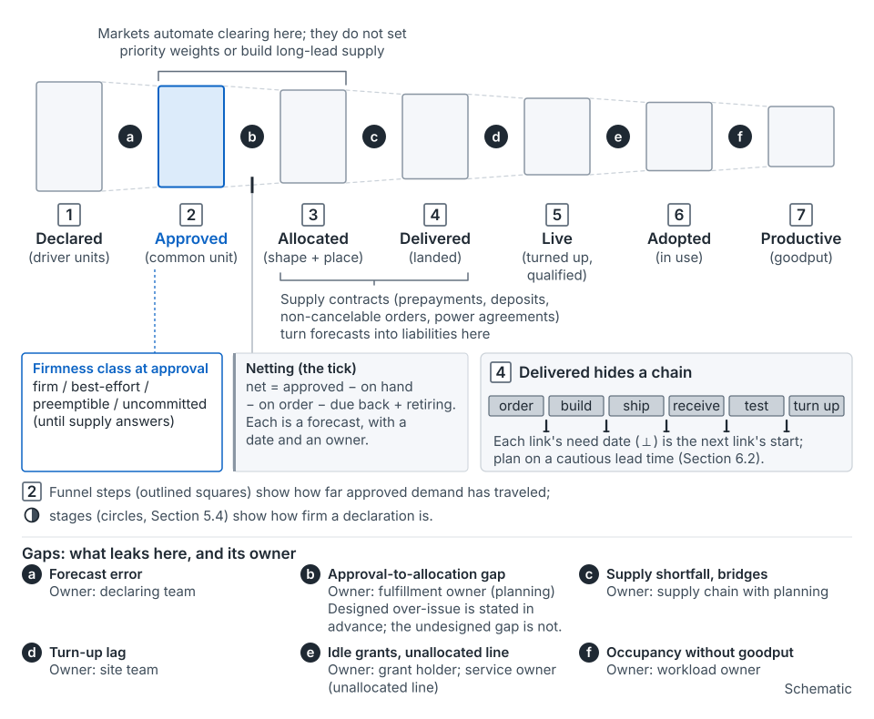

## The idea

The seed paper's second claim: **approval is not allocation** [argued]. Allocation here means placing demand on physical machines. A common unit lets unlike asks be compared and approved, but it doesn't source them.

Demand then passes seven steps: declared, approved, allocated, delivered, live, adopted, productive. Each has its own owner, and each can leak. Hixson and Guliani's lead-time table runs a similar line to "Ready to serve" [6].

*From the seed paper, Figure 15.* The steps after approval are where ownership most easily goes unassigned.

**A common unit prices; it doesn't clear.** Approved units must still become a CPU-to-memory ratio, storage and access rate, and a placement within latency limits [1]. They must also become hardware that exists in time.

**The unit's weights decide which asks look cheap.** A cost-weighted unit under-prices asks heavy on whatever is scarce. If memory binds and only standard machines exist, extra memory drags along cores nobody uses: stranded capacity. Microsoft's Pond paper measures the mirror case: "up to 25% of DRAM becomes stranded" as cores are allocated [57].

**Not every gap is a failure.** Three cases:

- *Capped issue* limits approval to sourceable supply.
- *Designed over-issue* sells entitlements beyond supply under a stated firmness class, as Borg does for low priorities [17].
- The *undesigned gap* is an approval treated as firm that supply can't meet.

Until supply answers with a dated commit or a named gap, label an approval *uncommitted*.

The gap isn't new. Auxon reports requirements it could not satisfy [1]. The 2026 SRE chapter says capacity must reach "the right consumer, in the right location, at the right time" [7]. The seed paper adds an owner and a ledger.

## Where it shows up on the map

- **Quarterly**, portfolio row: asks are approved in a common unit, with shapes asked for. See [the quarterly stage](stage-quarterly.md).
- **Monthly**, portfolio and region rows: the fulfillment ledger; machines arrive and turn up; netting runs. See [the monthly stage](stage-monthly.md).
- **Weekly**, region and unit rows: shortages, bridges, brokered trades. See [the weekly stage](stage-weekly.md).

## How to use it

**Keep a fulfillment ledger** (mechanism 5). Per ask, track approved (gross), net, committed, allocated, delivered, live and adopted, with the firmness class. Planning carries the gap; each step's performer owns its entry.

**Net with care.** Netting sits between approved and allocated on the ledger. Subtract on hand, on order and due back from reclaim; add back what retires that current load depends on. Every one of those is a forecast, so give each a date and an owner. A draw on a stocked pool leaves a replenishment owed. A reclaim that doesn't happen looks like a supply failure. Many undesigned gaps are born in this netting [argued].

**Re-shape before you cut.** It's nearly free before the order and costly after. In the SRE chapter's Meet case, doubling CPU and memory per instance halved the instance count [7].

**Bridge, then charge the premium to its cause.** When approved demand can't be sourced in time, you bridge. The levers, fastest first, are re-pegging a slipped launch's supply, reclaiming idle capacity, shifting demand and reallocating between tenants. Slower ones are deferring a decommission and third-party capacity. These speeds are the seed paper's judgment, not sourced figures. A bridge works only if arranged before you need it. Charge each premium to its cause, such as a late ask or a forecast miss. Spread across everyone, it teaches that late asks are free.

**Clear by brokering.** Matching a holder with a team that needs the same shape, place and time is Jevons's "double coincidence" [89]. Markets automate it for fungible, short-horizon resources [16, 18]. Elsewhere it runs on knowing who holds what [argued].

In the running example, the forum approved Product A at 4 NMU because the intake asked only about CPU. The data A stores needs memory, and the cheapest fit is 4.8 NMU (illustrative). The 0.8 NMU gap goes on the ledger with a named owner.

*From the seed paper, Figure 30.* The cheapest fit, and the gap. Illustrative.

## What goes wrong

- Approval treated as delivery; the team learns of the gap at launch.
- A reclaim or decommission in the netting doesn't happen, and looks like a supply failure.
- Delivered-but-not-live backlogs age quietly at turn-up.
- Bridge premiums spread across everyone, so late asks look free.

## Where this comes from

Seed paper, Sections 1, 6, 6.1, 6.4, 7 and 9.2 (mechanism 5). The lead-time line is Hixson and Guliani's [6]. Placement limits and unsatisfied requirements come from Auxon [1]. Pooled quota, the Meet case and the right-consumer framing come from the 2026 SRE chapter [7]. Also cited: [16–18, 57, 89]. See also [the commit-point method](concept-commit-points.md) and [buffers and reserves](concept-buffers-and-reserves.md).
