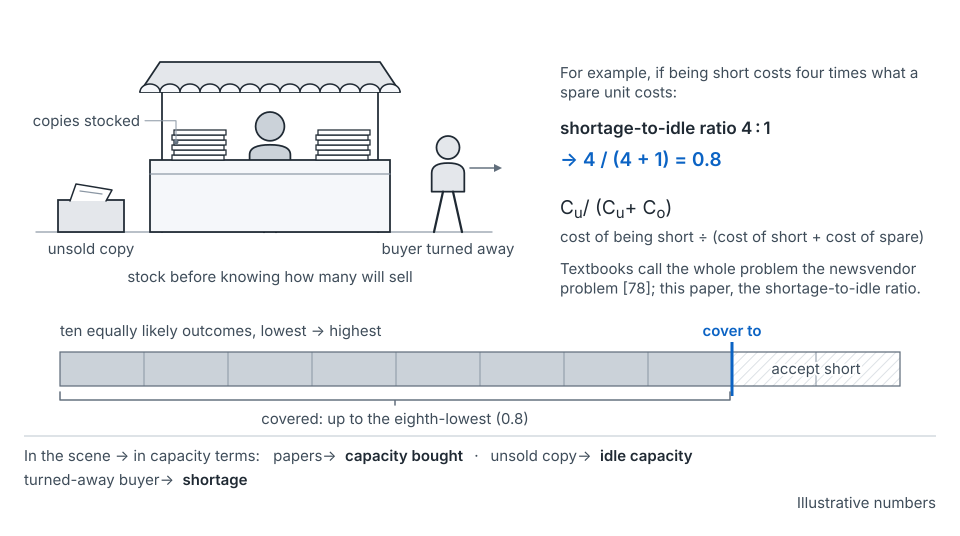

## The idea

A plan with one line called headroom hides at least six buffers. They are redundancy, maintenance reserve, queueing headroom, forecast-error buffer, launch reserve and inventory buffer. Each has its own owner and sizing. RAS publishes one operator's split: about 94% guaranteed, 2% for random failures, 4% for correlated failures [54]. Hixson and Guliani itemize storage blow-up factors the same way [6].

Not every buffer is installed. One operator plans component inventory "to high quantile forecasts" [8]; a stocked part pools across the shapes it can become.

**A buffer is a priced decision.** Compare the cost of running short with the cost of holding spare. The seed paper calls this the *shortage-to-idle ratio*; textbooks call the problem the newsvendor problem [78]. The fraction to cover is C_u/(C_u + C_o) [78]. At 4 : 1, cover 0.8: the eighth of ten equally likely outcomes.

*From the seed paper, Figure 20.* Buy up the range, weighted by which mistake costs more.

Hixson and Guliani frame the same choice: "That tolerance should define how aggressively you provision" [6].

**Lead time inflates buffers.** With independent errors, safety stock grows with the square root of lead time [78]. Capacity errors tend to run the same way each cycle, so they grow faster [argued]. Size from your own error-by-horizon curve.

**Pooling is the main economy.** For *n* identical, uncorrelated demands, pooled safety stock is √*n* times one location's [81]. The SRE chapter provisions for "the peak of the *summed* demands" [7]. Google reports pooling saves "approximately 5–20%" and reduces "the incentive for teams to hoard" [7]. The caveats matter. Correlation and heavy tails erode the gain [82]. Weinman: "the assumption of workload independence is a key one" [83]. And Meta moved AI training toward "pre-regionalized capacity contracts" [31].

## Where it shows up on the map

- **Annual**, envelope and region rows: finance and product sign the ratios per layer and kind of demand. See [annual](stage-annual.md).
- **Quarterly**, portfolio and launch rows: launch reserves are sized against declared highs. See [quarterly](stage-quarterly.md).
- **Monthly**, region and unit rows: stocked pools are drawn and replenished. See [monthly](stage-monthly.md).
- **Post-launch**: shortage budgets are backtested. See [post-launch](stage-post-launch.md).

## How to use it

**Let the ratio rise with lead time, for persistent demand.** The seed paper argues the ratio rises with lead time; it's not a published result [argued]. Illustratively: 1 : 1 for turn-up (the median), 4 : 1 for machines, 19 : 1 for power and shell. One operator plans its slow end "to a high quantile demand forecast" [8]. It holds only if the layers work together and the high is held mostly as options.

**Mind timing, size and persistence.** A size miss is paid on the slow and middle layers; a slip, on machines and turn-up. Size owned capacity on a transient spike and you buy permanent capacity for a temporary peak.

**Pool the launch reserve.** *One way to think about it* [argued]: hold one reserve for a group of launches with no shared driver, and give each a ranked claim. For example, four independent launches each with a 25,000 high slice, each half likely, need 75,000 at the 80th percentile, not 100,000 (illustrative). Tie them to one driver and the saving disappears. Hixson and Guliani's correlation check [6] is what makes this safe.

**Count a shortage budget.** *One way to think about it* [argued]: at 4 : 1, about one launch in five should need a bridge at that layer. Far fewer, two years running, and the ranges are padded. It's a backtest, as the chapter recommends for confidence levels [7].

In the running example, the method buys Product A's machines to 70,000, the configured 80th percentile. The launch lands at 40,000, so about $26,280 a year of extra spare sits idle (illustrative). That's the plan working inside its ratio.

## What goes wrong

- Ratios set by whichever critic spoke last.
- Pooling assumed where launches share a driver.
- A pool that's hard to draw on gets re-hoarded.

## Where this comes from

Seed paper, Sections 6.3, 6.5, 6.6 and 10.2. Blow-up factors, tolerance and the correlation check are Hixson and Guliani's [6]. Summed peaks, pooling savings and hoarding come from the 2026 SRE chapter [7]. Also cited: [8, 31, 54, 78, 81–83].
