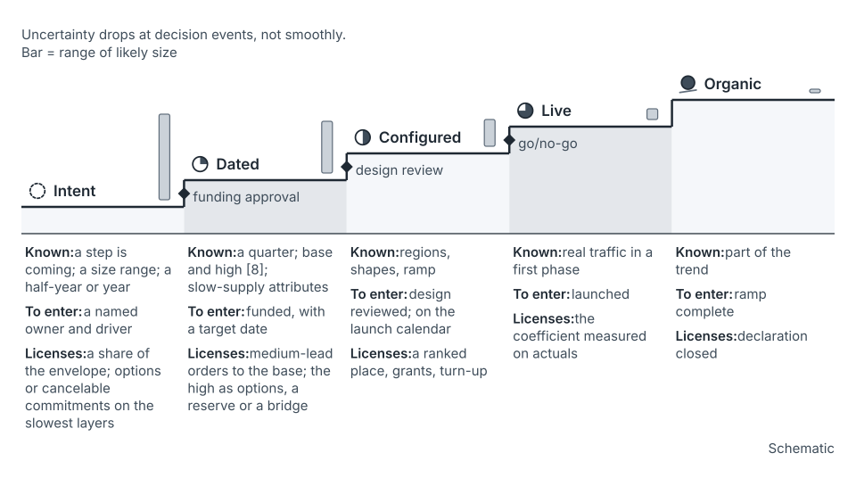

## The idea

Demand comes in two kinds. Organic growth comes from "the natural adoption and usage of your product by customers" [6]. Step changes come from a launch, a campaign or a business change [6]. A trend can extend the first. Nothing can extend the second, because it has no history.

The 2026 SRE chapter splits step-change demand in two [7]. *Planned* demand (launches, promotions, known events) is accounted for during launch planning. *Unplanned* demand (viral trends, news) is met with buffers, autoscaling and demand shaping [7].

For planned steps, the substitute for history is a **declaration**: a signed statement of expected demand, in units you already price [1, 6].

A declaration is still a forecast. The team makes it from the inside view, anchored on its plan [9]. You check it from the outside view: how comparable declarations turned out [10]. Olavson's team does this for capacity, and a large gap needs "a good story to explain the gap that everyone understands" [8].

**Declarations firm up in stages.** Uncertainty drops at decision events (funding, design review, go/no-go), not smoothly.

| Stage | What's known | Evidence to enter | What it licenses |
|---|---|---|---|
| Intent | A step is coming; a size range; a half-year or year | A named owner and driver | A share of the envelope; options on the slowest layers |
| Dated | A quarter; base and high scenarios [8]; the attributes that drive slow supply | Funded, with a target date | Medium-lead orders against the base; the high as options, a reserve or a named bridge |
| Configured | Regions, shapes, ramp and peak shape | Design reviewed; on the launch calendar | A place on the ranked list; grants; turn-up |
| Live | Real traffic in a first phase | Launched | The coefficient measured on actuals |
| Organic | The step is part of the trend | Ramp complete | Declaration closed; series handed to the organic baseline |

The rule: a stage licenses only its own supply action, and promotion needs the evidence on its row.

*From the seed paper, Figure 13.* A declaration firms up in stages, at decision events.

## Where it shows up on the map

- **Annual**, portfolio and launch rows: intents enter and claim a share of the envelope. See [the annual stage](stage-annual.md).
- **Quarterly**, launch row: intents become Dated, from about −6; the last review before launch may re-confirm them. See [the quarterly stage](stage-quarterly.md).
- **Monthly**, launch and portfolio rows: declarations reach Configured at about −3; configured asks are ranked and expiry clocks are checked. See [the monthly stage](stage-monthly.md).
- **Weekly**, launch row: pre-launch tests measure the coefficient [7]. See [weekly](stage-weekly.md).
- **Post-launch**, launch and portfolio rows: live, then organic; size and date are scored. See [post-launch](stage-post-launch.md).

## How to use it

**Score by stage.** Hixson and Guliani keep step changes itemized because it "gives you room to learn as you repeat the process" [6]. Scoring writes that learning down. Record three fields: the stage the ask was made at, declared size against actual, and declared date against actual.

**Blend the record.** One team's few launches are too few to estimate from. Start from the record of all teams at that stage, a reference class [10]. Weight the team's own record more as it grows. For example, if all teams' intents land at 60% of declared size and Team T's two landed at 50%, count the all-teams record as eight launches (illustrative). Then (8 × 0.60 + 2 × 0.50) ÷ 10 = 0.58, and T's next intent enters at 58%.

A team whose intents land at half but whose configured asks land within 10% (illustrative) is calibrated late, not dishonest [argued]. Discount its intents and trust its configurations.

**Set expiry.** An intent that hasn't advanced by its target date leaves the envelope unless re-confirmed. A configured launch's grant lapses if its date passes unconfirmed. The slip becomes a recorded event.

**Carry two shapes.** Declare a transient spike apart from a persistent step, and name any shared driver ([buffers and reserves](concept-buffers-and-reserves.md)).

In the running example, Product A's launch on Service X entered as an intent of 40,000 to 100,000 requests per second. The planner entered it at 60,000, where comparable intents had landed (illustrative). It landed at 40,000, six weeks late, and that joins the record.

## What goes wrong

- A launch arrives as a multiplier ("we'd double it") nobody can explain.
- Stage inflation: a declaration is promoted without its row's evidence.
- Parked intents hold envelope for launches nobody mentions anymore.
- Size and date are scored together, though they cost different things (Section 6.6 of the seed paper).
- The intake asks for size first and the slow-supply attributes never [argued].

## Where this comes from

Seed paper, Sections 3, 5.4, 6.6 and 9.3; terms from Appendix A. The organic and step-change split and itemizing come from Hixson and Guliani [6]. Planned and unplanned demand come from the 2026 SRE chapter [7]. Base and high scenarios and the customer-versus-statistical check come from Olavson [8]. The inside and outside views come from Kahneman and Lovallo [9] and Flyvbjerg [10]. The five stages, stage scoring and the blend are the seed paper's additions.
