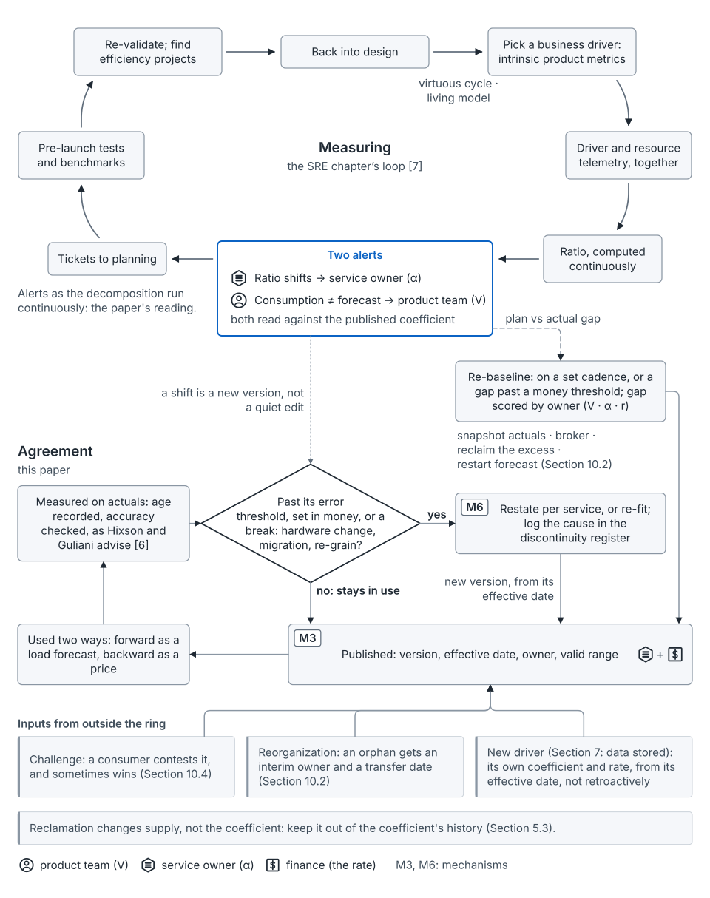

## The idea

Who notices when a coefficient drifts? The 2026 SRE chapter answers that, and this loop builds on it [7]. It starts from a driver that makes sense for the product, which it calls "intrinsic product metrics" [7]. It graphs ratios such as "cores per 1,000 active users," alerts when they shift or when consumption "deviates from predictions," reuses them before launch and re-validates them periodically [7]. As steps (the arrangement is the seed paper's, not the chapter's):

1. **Pick a business driver**, such as daily active users, sales transactions or page views [7].
2. **Instrument the driver and the infrastructure together**, including allocations and utilization [7].
3. **Compute the ratio continuously**, and graph it [7].
4. **Alert on two things**: the ratio shifting, and consumption departing from the forecast [7].
5. **Route deviations to planning.** If the service handles overload gracefully, a deviation can become a ticket for planning instead of a page [7].
6. **Reuse the ratios before launch**, in performance tests and A/B tests [7].
7. **Re-validate periodically**, and look for efficiency work [7].
8. **Feed it back into design**, which the chapter calls a "virtuous cycle" [7].

The chapter treats the mapping as "a living model that evolves alongside the system" [7].

**The added reading: the ratio is a price.** The seed paper's addition is the other reading of the same ratio [argued]. A change to it changes every caller's bill (see [the coefficient](concept-the-coefficient.md)). So a shift gets an owner and a new version with an effective date, not a quiet edit.

*From the seed paper, Figure 10.* The measuring ring tracks the ratio and raises two alerts [7]; the agreement ring publishes, versions and restates it.

## Where it shows up on the map

- **Weekly**, unit row: the ratio is computed continuously while the service is tuned. See [weekly](stage-weekly.md).
- **Weekly**, launch row: ratios feed pre-launch tests, so a configured declaration carries a measured coefficient [7]. See also [declarations](concept-demand-and-declarations.md).
- **Monthly**, unit row: the ratio is compared with its published version. See [monthly](stage-monthly.md).
- **Post-launch**, unit and portfolio rows: the two alerts are read against the published version, tickets reach planning, and the plan is re-validated or re-baselined. See [post-launch](stage-post-launch.md).

## How to use it

**Read the two alerts as owners.** *One way to see it* [argued]: the two alerts are the variance split, run continuously. Nobody has tested this reading in public [unmeasured].

- The **ratio alert** watches α, the service owner's term. It has to compare with the published version, not just the recent past. A coefficient wrong from the start never shifts.
- The **forecast alert**, read while the ratio holds, watches volume, the product team's term.
- Neither watches the rate; that's the price list's job.

The owner still records the cause, since a caller's mix can move α too.

**Consider a cadenced re-baseline.** *One way to think about it* [argued]: the re-baseline used after a shock doesn't have to be one-off. Run it on a set cadence, or when the plan-to-actual gap passes a threshold set in money. Each re-baseline's gap is the forecast error. Split it by owner, and let each owner's record set how far its next forecast is trusted. This sits close to the chapter's advice to backtest predictions and re-validate the plan periodically [7]. Scoring the gap by owner is the seed paper's addition, untested [unmeasured].

In the running example, a release of Service X raised CPU per call from 2.5 to 3.125 ms (illustrative). With both alerts live, that would have reached X as a ticket long before the year-end bill [argued].

## What goes wrong

- The ratio is compared only with its recent past, so a coefficient wrong from day one never alerts.
- A shift is fixed by a quiet edit, so callers' bills move with no record.
- Alerts page on-call instead of reaching planning.
- Reclamation is logged as a coefficient change; it changes supply, not α.

## Where this comes from

Seed paper, Section 5.2, with Sections 5.4, 7 and 10.2. The ratio monitoring, the two alerts and the backtesting advice come from the 2026 SRE chapter, by Gordon, Kirby, Hixson and colleagues [7]. The eight-step layout is the seed paper's arrangement. Quoted phrases from the chapter stay its authors' and publisher's, as the [licence page](https://cpp.anacay.org/license/#exceptions) explains. Hixson and Guliani earlier advised checking that blow-up factors "remain accurate" [6]. The price reading, versioning, alert-to-owner routing and cadenced re-baseline are the seed paper's additions, labeled as explorations.
