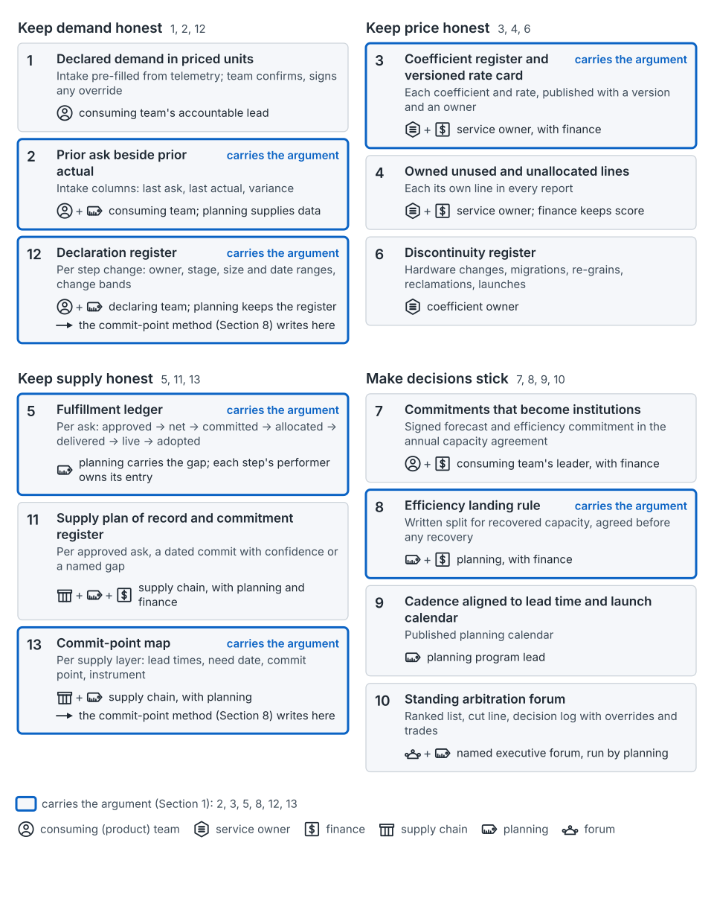

## The idea

Sections 7 and 8 of the seed paper build the artifacts for one launch. The harder job is keeping them true as people, budgets and coefficients move. Much of this is published. There's a monthly consensus forecast [8] and capacity contracts with a plan of record [31]. There's an intake that knows each team's idle capacity [34], and the SRE chapter's plan of record [7]. What the seed paper offers is one set of artifacts and owners that joins them [argued].

The thirteen do four jobs.

| Job | # | Mechanism | Owner | Indicator |
|---|---|---|---|---|
| Keep demand honest | 1 | Declared demand in priced units | Consuming team's accountable lead | Capacity with a named declarer |
| | 2 | Prior ask beside prior actual | Consuming team; planning supplies data | Bias by owner; by stage for step changes |
| | 12 | Declaration register | Declaring team; planning keeps it | Step changes declared a stage before their commit point |
| Keep price honest | 3 | Coefficient register and versioned rate card | Service owner, with finance | Variance from unannounced changes |
| | 4 | Owned unused and unallocated lines | Service owner; finance keeps score | Unused and unallocated shares and trends |
| | 6 | Discontinuity register | Coefficient owner | Error after discontinuities |
| Keep supply honest | 5 | Fulfillment ledger | Planning carries the gap | Unfulfilled backlog and its age |
| | 11 | Supply plan of record and commitment register | Supply chain, with planning and finance | Promised versus actual, by stage |
| | 13 | Commit-point map | Supply chain, with planning | Orders placed after their commit point |
| Make decisions stick | 7 | Commitments that become institutions | Consuming team's leader, with finance | Capacity under signed commitment |
| | 8 | Efficiency landing rule | Planning, with finance | Recovery re-funded versus clawed back |
| | 9 | Cadence aligned to lead time and launch calendar | Planning program lead | Launches needing exceptions |
| | 10 | Standing arbitration forum | Named executive forum, run by planning | Decisions reopened; overrides |

*From the seed paper, Figure 39.* The discipline as thirteen artifacts, grouped by job.

Mechanism 3 keeps [the coefficient](concept-the-coefficient.md) an agreement. Mechanism 5 tracks the gap in [approval and allocation](concept-approval-and-allocation.md). [The commit-point method](concept-commit-points.md) writes into 12 and 13.

## Where it shows up on the map

They run across every column and row. The cadence itself is mechanism 9, published as the planning calendar. One reading of where each is updated [argued]:

| Cadence | Mechanisms updated |
|---|---|
| [Annual](stage-annual.md) | 7 and 8 signed; 9 published; 10's cut line and re-cut order; 12's intents; 13's slow layers |
| [Quarterly](stage-quarterly.md) | 1 and 2 at the intake; 3's versions agreed; 12 from Intent to Dated; 11 at the supply review; 13's machines and parts; 10's ranked list |
| [Monthly](stage-monthly.md) | 5; 11's commits and named gaps; 12 to Configured; 13's pool and turn-up; 10's re-rank |
| [Weekly](stage-weekly.md) | 5's bridges; 10's overrides and trades; 11's re-pegging; 12's slips |
| [Post-launch](stage-post-launch.md) | 3 restated when actuals or hardware change; 4 and 6; 8 applied; 12 scored; 2's actuals; 11's promises scored |

Each stage page lists its artifacts in a table under "What it hands on".

## How to use it

**You'll know it's working when…** Seven have a test that can fail:

- **2:** forecast bias falls within a number of cycles stated in advance.
- **3:** variance from unannounced changes shrinks.
- **5:** fewer launches are delayed for capacity.
- **8:** re-funded recovery lasts; clawed-back recovery decays.
- **11:** promised and actual delivery dates converge, and fewer approvals turn out to be undesigned gaps.
- **12:** intents' size error becomes stable enough to discount.
- **13:** fewer orders are placed after their commit point, and bridge premiums shrink.

Mechanisms 1, 4, 6, 7, 9 and 10 have no such test yet. Watch their indicators.

**The nine decision rights** sit outside the owner column:

| Decision | Who holds it |
|---|---|
| Overriding the cut line | A named executive, logged with the displaced claim |
| Re-cutting when the envelope changes | The forum, in ranked order, with finance |
| Promoting, demoting or expiring a declaration | Planning, on evidence or a missed date |
| Re-signing after a reorganization | The new accountable leader |
| Interim owners for orphaned coefficients | Planning |
| Shortage-to-idle ratios | Finance and product jointly; supply gives idle cost and liabilities |
| Change bands inside each lead time | Supply and planning, signed by the declaring team; finance agrees who pays outside them |
| Answering an ask; accepting a substitute | Supply |
| Reliability buffers | Reliability engineering |

**Agree the landing rule before any recovery.** Recovered capacity has to land where the recoverer sees it, as gain-sharing plans recognize [4]. A rule agreed in advance is a contract; one proposed afterwards is a request.

**Give the unallocated line an owner.** TBM parks it in staging buckets [38]; the FinOps Foundation describes an "informed ignore" [21]. Neither names an owner accountable for shrinking it.

## What goes wrong

- Enforcement depends on one planner's persuasion, which doesn't scale.
- Overrides are invisible, so the ranked list stops meaning anything.
- Shortage rules are written during the shortage, as a negotiation.
- Indicators become self-assessment because planning, not finance, keeps the score.

## Where this comes from

Seed paper, Sections 1, 9.1–9.4. Published pieces: consensus forecasting [8], capacity contracts [31], a driver-based intake [34], the plan of record [7], gain-sharing [4], unallocated cost practice [21, 38]. Little has been measured in public. Olavson reports component safety stock at about 0.6 times its customer-driven level under triangulation [8]. Gupta reports a driver-based intake cutting a three-to-four-month exercise to about one month [34].
