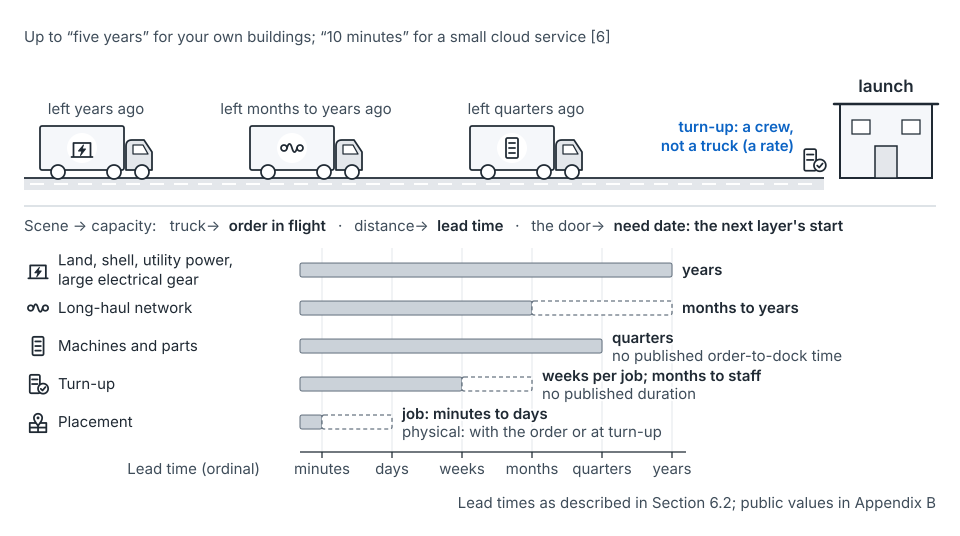

## The idea

What arrives next quarter was ordered long ago. How long ago depends on the layer. Hixson and Guliani give the span: order time "could be five years if you erect your own buildings," and "10 minutes" for a small cloud service with good automation [6].

| Layer | Lead time | Public record |
|---|---|---|
| Land, shell, utility power, large electrical gear | Years | "planned years in advance" [8]; grid connections and large transformers take years [60–62] |
| Long-haul network | Months to years | "months or even years to deliver" [63] |
| Machines and parts | Quarters | "over 6 months for some components" [8]; one accelerator vendor, "more than 12 months" in its own supply [64] |
| Turn-up | Weeks per job; months to staff | No published value |

A large new power load waits in the utility's own process, and little is published on how long [65].

*From the seed paper, Figure 16.* Supply is already on the highway; the slower the layer, the longer ago it had to leave.

**Usual and cautious lead times.** Late arrivals are common and early ones rare [argued]. So plan on a cautious lead time, near the slow end of what you've seen. For example, if machines usually take one quarter but one order in five takes two, plan on two.

**Layers stack.** The hall comes before the machines, the machines before turn-up. So a layer's need date is the next layer's start, not launch day. Microsoft's chief executive described the failure: "I don't have warm shells to plug into" [66].

**Turn-up is a rate, not an order.** Crews, dock space and test positions set it, like a checkout line. A slipped batch queues behind the next one, so a slip often shows up twice [argued].

**Contracts.** Supply is bought through prepayments, take-or-pay commitments, non-cancelable orders and long power agreements. Once its cancel window closes, a contract's forecast becomes a liability. Give each one a register entry with its liability schedule, cancel window and owner. Operators name the risk: long commitments behind shorter customer contracts [68, 69].

A cancel window is rarely one date. What you owe usually rises in steps toward delivery. No published terms of that kind were found. Because the most common timing miss is a slip, the right to push a delivery out is often worth more than the right to cancel [argued].

**Options and postponement.** An option is a small payment now for the right to buy later. Keep supply generic until the decision that says which shape [73]. Meta describes staging data center sites so it can "spring up capacity quickly," and partnerships that give "option value for future compute needs" [74]. Quantity-flexibility contracts let an order move less as delivery nears [70, 71].

**Supply has step changes too.** New sites, hardware generations, rationed parts and decommissions all move in steps. Supply firms up in its own stages: planned, contracted, under construction, delivered, live [68, 92]. Decommission is negative supply [2]. Score supply promises like demand declarations.

## Where it shows up on the map

Each layer's commit point lands in the cadence its lead time forces. The table is the one on [the map](the-map.md); timings vary by operator and market:

| Supply layer | Typical commit point | Lands in | The declaration is usually |
|---|---|---|---|
| Land, power, building shell | One to several years ahead | Annual | Intent, or none |
| Long-haul network; large contracts | Several quarters | Annual or quarterly | Intent to Dated |
| Machines and parts | One to three quarters | Quarterly | Dated |
| Machines from a stocked pool | Weeks; at configuration in the worked example | Monthly | Configured |
| Turn-up and allocation | Weeks per job; the rate is staffed months ahead | Monthly | Configured |
| Job placement and admission | Minutes to days | Weekly | Live |

The stage pages say what lands in each: [annual](stage-annual.md), [quarterly](stage-quarterly.md), [monthly](stage-monthly.md) and [weekly](stage-weekly.md). After launch, supply promises are scored against actuals ([post-launch](stage-post-launch.md)).

## How to use it

- List every layer a launch touches, with usual and cautious lead times. Use Appendix B of the seed paper as a sanity check, not as your number.
- Work back from the ready-for-service date: each need date is the next layer's start.
- Register every contract with its liability schedule, cancel window and owner.
- Send a vendor the base and hold the high as options. Padding at three layers of 10% each compounds to about 1.33 times real demand (illustrative), the "rationing game" [67].
- Check supply for shared drivers: four sites waiting on one transformer supplier slip together.

In the running example, high-memory machines take two quarters and standard machines come from a stocked pool in weeks (illustrative). The two need different commit points inside one launch. See [commit points](concept-commit-points.md).

## What goes wrong

- Planning on the usual lead time, then expediting in a bad year.
- Ordering the fast layer before the slow one it waits on.
- Liabilities discovered at quarter close.
- Taking supply promises at face value while discounting demand intents: half an outside view.
- A slipped decommission stalling an on-time delivery.

## Where this comes from

Seed paper, Sections 6.2, 6.4 and 6.7, step 1 of Section 8.2, and Appendix B. Order times and planning horizon from Hixson and Guliani [6]. Public lead times from [8, 60–64]; the power wait from [65]. Contracts and the mismatch risk from [68, 69]. Staging sites and option value from Meta [74]. Postponement from Feitzinger and Lee [73]; quantity flexibility from Tsay [70, 71]. Supply stages from [68, 92]; decommission as negative supply from Flux [2].
