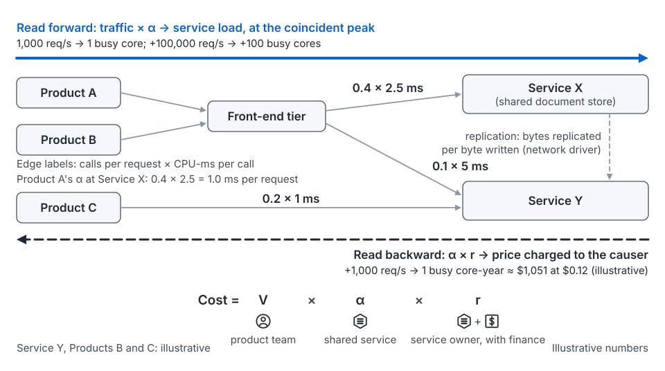

## The idea

A caller's bill on a shared service is approximately:

**Cost = V × α × r**

*V* is volume, how much the caller does; the product team owns it. α is the coefficient, resource used per unit of volume; the service owns it. *r* is the rate, cost per unit of resource; the service owns it with finance.

**One coefficient, two readings.** The planner reads α forward, as a load forecast. The product team reads it backward, as a price. In the running example, Product A makes 0.4 calls to Service X per request at 2.5 ms each, so α is 1.0 ms per request (illustrative). Forward, 100,000 more requests per second means 100 more busy cores. Backward, each extra 1,000 requests per second costs about $1,051 a year. If α moves, the fleet plan and the bill move together.

*From the seed paper, Figure 9.* The same coefficient forecasts a service's load and prices a caller's growth.

That's the seed paper's first claim: **a coefficient is an agreement** between those who supply and consume shared capacity [argued]. It holds only while the agreement is kept. It extends Meta's "capacity contracts" [31] from the amount of capacity to the coefficient and rate behind its price.

**The grain problem.** Usage is measured by job and location; decisions are made by product and budget line. Twitter's chargeback design starts from "a canonical way to identify a service across infrastructures" [14]. But a tag says who owns a resource, not who caused the load.

**Back-adjust through breaks.** A hardware change, a migration or a re-grain (a change in how the metric is measured) is like a stock split. Restate the history on the new basis, per service, measured. A trend fitted through the break misreads next year. Where the ratio must be estimated, intervention analysis represents the break explicitly [55]. Reclamation changes supply, not the coefficient, so keep it out of the history.

## Where it shows up on the map

- **Quarterly**, unit row: the coefficient is agreed and published. See [the quarterly stage](stage-quarterly.md).
- **Monthly** and **weekly**, unit row: the ratio is watched and tuned. See [monthly](stage-monthly.md) and [weekly](stage-weekly.md).
- **Post-launch**, unit and portfolio rows: actuals become the next coefficient, breaks are logged and variance is split by owner. See [post-launch](stage-post-launch.md).

## How to use it

**Keep a coefficient register and a versioned rate card** (mechanism 3). Publish each coefficient and rate with a version, an effective date, an owner and a valid range. A change is a new version, not a quiet edit.

**Set a re-fit threshold in money.** *One way to think about it* [argued]: threshold = drift × volume × rate. For example, 5% drift on a $525,600 bill is about $26,000 a year (illustrative). Hixson and Guliani advise checking blow-up factors regularly to see they "remain accurate" [6]. They also ask you to write down design assumptions [6]; that's the valid range.

**Split a miss by term.** ΔCost = ΔV·α₀·r₀ + V₁·Δα·r₀ + V₁·α₁·Δr. Each piece goes to whoever moved it. The order of the swaps is a policy choice; a symmetric method avoids it [52]. In the running example, A's volume landed within 4%, but the bill came in 30% over. The coefficient term (+$126,144) and rate term (+$52,560) were Service X's (illustrative).

**Keep a discontinuity register** (mechanism 6). Log hardware changes, migrations, re-grains, reclamations and launches. Smooth the organic baseline statistically [56], and declare the steps.

**Add a driver when one is missing.** Service X priced only CPU while A's data drove memory, so X added data stored as a driver, from its effective date.

Watching the ratio is [the measuring loop](concept-measuring-loop.md); the rate's meaning is in [three prices](concept-three-prices.md).

## What goes wrong

- A drifting, unversioned rate: an unrecorded change to every caller's plan.
- Forecasting through a hardware change instead of restating.
- A reorganization orphans a coefficient, unnoticed until it drifts.
- A cost the meter can't see (memory, here) reappears as an unexplained rise in another rate.

## Where this comes from

Seed paper, Sections 1, 5.1–5.3 and 9.2 (mechanisms 3 and 6); the worked numbers are from Section 7. Accuracy checks and written design assumptions come from Hixson and Guliani [6]. The service-identity tag comes from Twitter's chargeback design [14]. The claim extends Meta's capacity contracts [31]. Also cited: [52, 55, 56].
