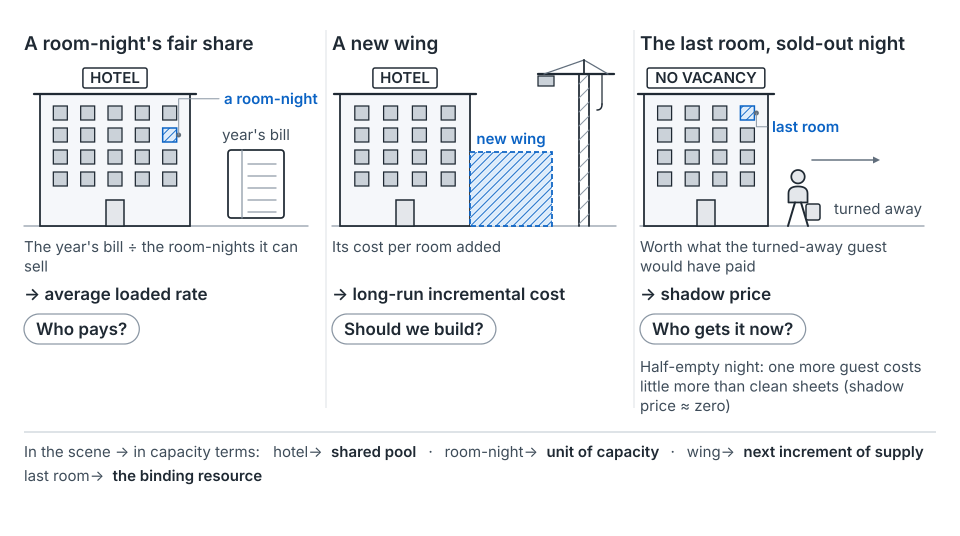
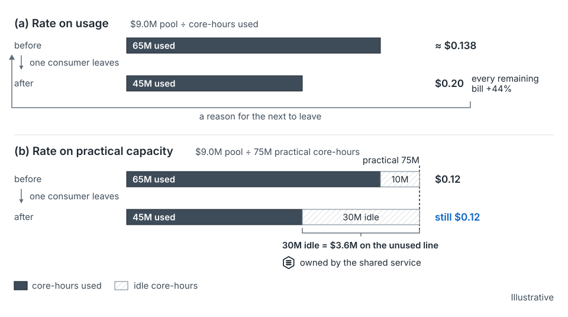

## The idea

Ask what new capacity costs and you can get three numbers. Each is right for a different question. A hotel shows why. The year's bill over room-nights sold gives each guest's fair share. A new wing has its own cost per room. And the last room on a sold-out night is worth what the turned-away guest would have paid.

| Price | What it is | Question it answers | Misleads when used for |
|---|---|---|---|
| **Average loaded rate** | Fully loaded pool cost ÷ practical capacity | Who pays? | Marginal decisions: too high in slack, too low under scarcity |
| **Long-run incremental cost** | Cost of the next increment of supply per unit of driver | Should this growth be built for? | Pricing capacity that already exists |
| **Shadow price** | What one more unit of the binding resource is worth; zero for slack | Who gets scarce capacity now? | Recovering fixed cost; budgeting |

*From the seed paper, Figure 7.* One hotel, three prices.

The shadow price is the textbooks' dual value of the capacity constraint [35]. Machines come whole, so any computed value jumps at machine boundaries. Internal markets try to discover it, following Hirshleifer's rule of transfer pricing at marginal cost [36].

**Isn't any split arbitrary?** Thomas called joint-cost allocations "incorrigible" [37]. The TBM Council concedes weighting factors "can be subjective" [38]. The practical answer is to stop asking one price to do three jobs. Axiomatic allocation (the Shapley value and descendants) picks a split by stated properties [39–42]. Peak-load pricing assigns capacity cost to demand at the peak it was built for [43, 44]. Both make judgment declared and defensible.

## Where it shows up on the map

- **Annual**, envelope row: long-run incremental cost sizes the envelope and strategic bets. See [the annual stage](stage-annual.md).
- **Quarterly** and **monthly**, portfolio and unit rows: the average rate sets budgets; the shadow price ranks scarce shapes. See [quarterly](stage-quarterly.md) and [monthly](stage-monthly.md).
- **Post-launch**, unit row: the rate term of the variance split, and the unused line. See [post-launch](stage-post-launch.md).

## How to use it

**Divide by what you can use, not what got used.** Set the rate on practical capacity (usable after redundancy, maintenance reserve and queueing headroom). Report the idle remainder as its own owned line, the unused line [48, 49]. For example, a $9.0M pool with 75M core-hours of practical capacity gives $0.12 per core-hour (illustrative). If a consumer leaves, the rate stays $0.12, and the idle hours sit on the unused line. Set on usage, the same departure raises every other bill about 44%. Utility economists call that loop a death spiral [47].

*From the seed paper, Figure 8.* Set the rate on practical capacity and the idle remainder becomes its own owned line. Illustrative.

**Declare "fully loaded."** Name depreciation over a stated useful life, contracted power, space, network, staff and ideally a capital charge. Useful life alone moves both ways: Meta lengthened it for non-AI servers [45], and Amazon shortened it for a subset [46].

**Attribute what you can measure; apportion the rest by declared policy.** Cloud tools encode versions of this, such as reporting unrequested capacity as its own line [50, 51].

**Read the shadow price off the binding dimension.** In the running example, Product A needed 0.8 TB more memory than its CPU-sized machines brought. With only standard machines, each extra GB costs five times its unit weight (illustrative). That premium is memory's shadow price. See [approval and allocation](concept-approval-and-allocation.md).

After the review, the three prices give three answers. Average rates for CPU and memory set A's budget. Long-run incremental cost is memory-driven: 4.8 NMU, not 4.0. The shadow price falls on whichever dimension binds.

## What goes wrong

- Using the average rate to decide whether one more job is worth running.
- Setting the rate on usage, so one departure invites the next.
- Leaving "fully loaded" undeclared, so useful-life changes move every bill silently.
- Pricing a scarce dimension at its cost weight and approving asks that strand capacity.

## Where this comes from

Seed paper, Sections 4, 6.1 and 7. Shadow price as dual value [35]; transfer pricing [36]; incorrigibility [37]; subjective weights [38]. Axiomatic allocation [39–42] and peak-load pricing [43, 44]. Useful-life changes [45, 46]; the death spiral [47]; time-driven activity-based costing and the unused line [48, 49]; cloud cost tools [50, 51].
