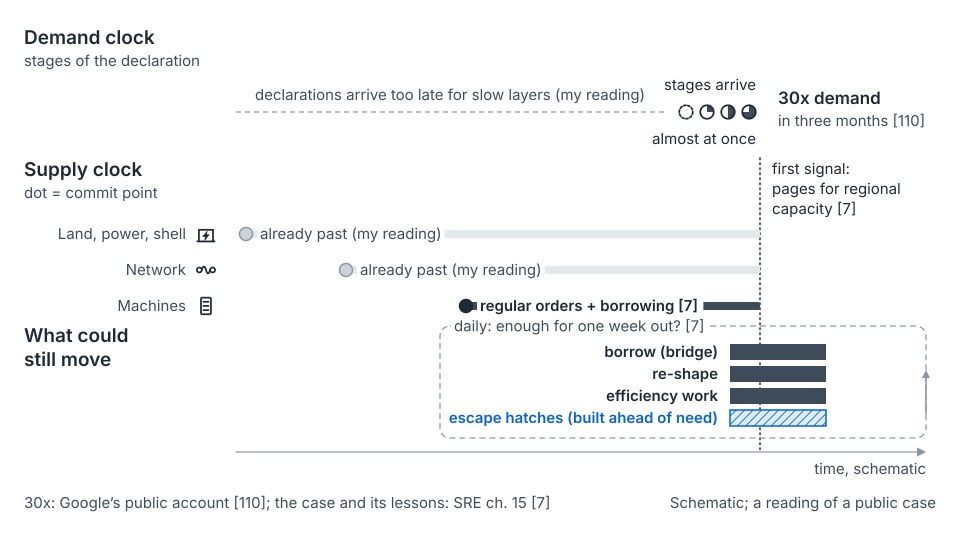

## Read this before you rely on anything here

The seed paper is a practitioner synthesis, not a measured study. The [commit-point method](concept-commit-points.md) is untested. Most numbers in this guide are illustrative. This page says where the ideas break, and what is known, argued or missing.

## Where the ideas break

**Caching, batching and statefulness.** A per-request coefficient fails when cost depends on cache state, batch makeup or data size. Miss-rate coefficients, declared apportionment rules and load tests help. But large published attribution systems still leave residuals, partly from modeling, not only ownership [2].

**Elastic cloud.** Fulfillment moves to the provider, then comes back as regional stockouts and reservation planning. Even guaranteed cloud capacity has a lead time. AWS accepts a future-dated reservation "between 5 and 120 days in advance," and may decline it [109]. Below materiality, the mechanisms cost more than they return [7]. See [settings](settings.md).

**No reference class.** Some steps are new at the resource level, such as a first accelerator cluster or a first region on a new continent. There is no record to read a stage against. You can only bound it, phase it and buy options.

**Demand no one can declare.** For a step nobody sees coming, what remains are buffers, bridges and, at the limit, admission control [33]. Hixson and Guliani's Plan B for a "success disaster" covers the same case [6]. The SRE chapter calls it unplanned inorganic demand, with a public video-meeting case [7]. That service's own account reports "30x demand" in three months [110]. Another operator's allocator team spent buffer on purpose under the same shock [111].

The seed paper reads that case through its own tools. Most slow layers' commit points had already passed, so fast levers did the work. The lesson it draws: where no one can declare in time, build the named slice first [argued].

*From the seed paper, Figure 47.* A public case on the two clocks. Schematic; the seed paper's reading, not the case authors'.

**Indicators become targets.** By Goodhart's law, any indicator can be gamed once it's rewarded. Read the [operating mechanisms](concept-operating-mechanisms.md) indicators as a set.

## What the method doesn't claim

- **Not an estimate.** The ten-outcome lists, ratios and bands write judgment down. They estimate nothing.
- **Not tested.** If it works, there should be fewer orders after their commit point and smaller bridge premiums [unmeasured].
- **Not optimal.** Buying each layer to its own cover point is a rule of thumb, not a joint optimum. A data scientist could do better.
- **Blind spots.** Coefficient drift, correlated launches and undeclarable demand each need something else to catch them.

Three ideas in the seed paper are labeled explorations: a sized fast lane, re-pegging slipped supply, and a simulation to stress-test the hand calculation. None has been tried in public [unmeasured].

## What has and hasn't been measured

| Status | What |
|---|---|
| Published | The cost-driver arithmetic, computed at scale [1, 2]. Attribution coverage and residuals [2]. |
| Nearest results on the mechanisms | Parts safety stock at about 0.6 times under triangulated forecasts [8]. A driver-based intake cut planning from three to four months to about one [34]. |
| Published in part | Lead times by layer [6, 8, 60–64, 109]. How long large new loads wait for power, on which little is published [65]. Uncertainty at a commit point, observational only [8]. |
| Argued, not measured | The thirteen mechanisms joined together. The cover point rising with lead time. The commit-point method. |
| Not found in public sources | Order-to-dock times, turn-up durations and hardware contract terms [unmeasured]. |
| Not found in public sources | Coefficient drift over time, and how often coefficients are recalibrated [unmeasured]. |
| Not found in public sources | How well declarations are calibrated by stage, and how often launches slip [unmeasured]. |
| Not found in public sources | Mechanisms for arbitrating scarce accelerators between internal and external demand [unmeasured]. |

On that last row, one preprint covers arbitration among internal teams only [18]. Operators state splits and priority orders, not mechanisms [90, 102]. Attribution for stateful services and batched inference is open. The seven tests listed under the mechanisms have not been run.

"Not found" means not found in the sources the seed paper could read. That includes the 2026 SRE capacity chapter [7].

## What this guide adds, and how sure it is

The guide adds two organizing ideas: [the map](the-map.md) of cadence by altitude, and [the path](the-work-and-the-path.md) of who usually works where. Both are argued from practice [argued]. Nobody has checked them against how planning teams actually divide the work [unmeasured]. The "what to fix first" table in [settings](settings.md) is judgment too.

## What would help most

Multi-organization data on forecast bias, unallocated share and fulfillment age, before and after these mechanisms are adopted. That is the seed paper's own answer, and the best contribution you could bring. A dated, anonymized case is a good start (see [cases](cases.md)).

## Where this comes from

Seed paper, Section 13 (limits and unknowns), Section 8.6 (what the method doesn't claim) and Section 9.4 (how to tell if it works). The evidence table follows Figure 48, with supply sources in Appendix B.

Public sources:

- Auxon [1] and Flux [2] on the arithmetic and attribution.
- The 2026 SRE chapter on materiality and unplanned demand [7], and Hixson and Guliani's Plan B [6].
- Admission control [33], and the public surge accounts [110, 111].
- Olavson [8] and Gupta [34], the nearest results on the mechanisms.
- The quota-marketplace preprint [18], and operator statements [90, 102].
- Lead-time sources [60–64, 109], and LBNL on large loads [65].
