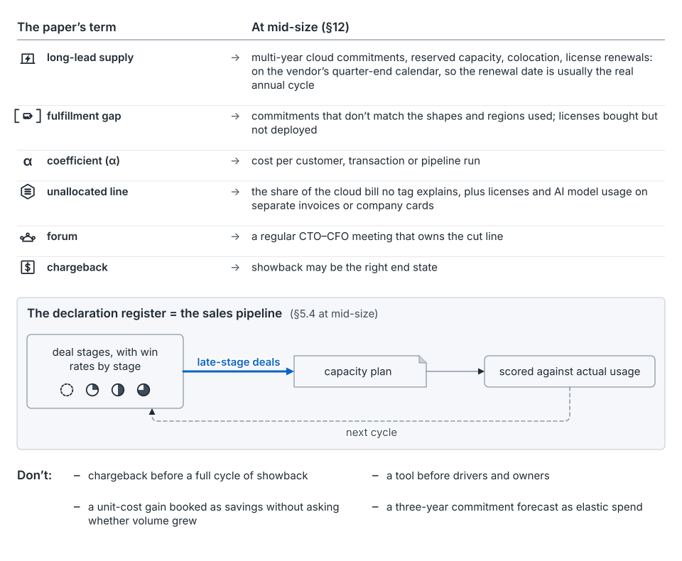

## Scale it to the risk

The full discipline is thirteen mechanisms on a nested cadence. Few settings need all of it. The question is where running short would cost more than the process does.

The 2026 SRE chapter asks this first: whether you need "the rigorous and expensive process" at all [7]. For small workloads, it says, "simple overprovisioning is often the best strategy" [7]. Precision is "only valuable relative to" your other problems [7].

One way to answer it is layer by layer. Compare each supply layer's lead time with how long a launch takes to firm up, from dated to live. Where supply is faster, react: autoscaling and shared buffers do the job. Where supply is slower, that layer needs a [commit point](concept-commit-points.md). Skipping the discipline below that line is a fair choice, but it has a tail (Section 13).

## AI and accelerator fleets

The structure holds. The units move.

- **Power binds.** For the largest operators, by their own public account, the binding constraint has moved toward power [72, 90, 100]. The SRE chapter says "strict supply constraints define fleet planning" [7]. Rank asks by value per megawatt, and say which power you mean.
- **Topology is a shape.** A training job needs contiguous accelerators in one interconnect domain. A fleet can hold enough chips and still be unable to place it [18, 103].
- **A training cluster is a step on both sides.** Power and cooling are committed while the run is still an intent. The commitment rides on a hardware generation that may slip.
- **An AI release is two shapes.** It is a transient inference spike on a persistent step. Declare each separately.
- **The token is a non-uniform driver.** Prefill and decode cost differently [104]. One price per token misprices prefill-heavy, decode-heavy and long-context work.
- **A busy chip isn't a productive one.** Productivity goodput splits time into scheduled, saved and efficient work [105]. Each lost slice gets its own owner.

Scarcity also turns unused capacity into competing claims [101]. Operators disclose splits between internal and external demand, not the mechanisms behind them [90, 102]. See [three prices](concept-three-prices.md) for ranking by the binding resource.

## Mid-sized companies

A company of a few hundred to a few thousand people rarely has data centers or a planning team. It still has shared services, and teams that cause cost without seeing the bill.

*From the seed paper, Figure 46.* At mid-size, the long-lead supply is the cloud commitment and its renewal date. The declaration register often already exists as the sales pipeline.

- **Long-lead supply** is the multi-year cloud commitment, reserved capacity and license renewals. The renewal date is usually your real annual cycle.
- **The fulfillment gap** is commitments that don't match the shapes and regions you use. A discount isn't capacity: Azure's reservations "provide a billing discount only and don't guarantee capacity" [58].
- **The forum** is a regular CTO–CFO meeting that owns the cut line.
- **The broker** is often nobody. Name someone, even part-time.
- **Declarations** already live in the sales pipeline, with win rates by stage. Feed late-stage deals into the plan and score them against usage.

A path in steps: overprovision and autoscale, and watch the bill. Then show each team its cost, with owners for the three largest coefficients. Then feed late-stage deals into the plan. Then walk the renewal through the worksheet (Appendix A). Stop where the next step costs more than it saves.

What to skip: chargeback before a full cycle of showback, and a tool before drivers and owners. Forecasting that applies "KPI growth on actual spend" [108] suits elastic spend; a commitment also needs lead time and shape.

## A minimum viable discipline

When you scale up, this is the floor. Six roles each keep one promise (Section 14):

- **Platform leaders** publish each material coefficient and rate, with an owner and a change log.
- **Planning** keeps the fulfillment ledger, carries the gap and walks each step change through the method.
- **Finance** agrees in advance the landing rule, the shortage-to-idle ratios, the re-cut order and who pays for regressions.
- **Product leaders** confirm the pre-filled intake, sign what they change, and declare step changes in stages.
- **A standing forum** owns the ranked list and the cut line.
- **Supply** answers every approved ask with a dated commit or a named gap.

## What to fix first

This table is judgment, not a measured ranking [argued]. Start with the row that hurts most.

| If you see… | Start with | Page |
|---|---|---|
| Bills miss and nobody can say why | Split the miss by term; publish coefficients (mechanism 3) | [The coefficient](concept-the-coefficient.md) |
| Approved asks don't become machines on time | Fulfillment ledger and a supply answer per ask (5, 11) | [Approval and allocation](concept-approval-and-allocation.md) |
| Launches arrive as surprises | Declaration register, or the sales pipeline (12) | [Demand and declarations](concept-demand-and-declarations.md) |
| Long-lead orders placed too late | Commit-point map (13) | [Commit points](concept-commit-points.md) |
| Asks padded "just in case" | Last ask beside last actual (2) | [Operating mechanisms](concept-operating-mechanisms.md) |
| Spend nobody owns | Owned unallocated line (4) | [Operating mechanisms](concept-operating-mechanisms.md) |
| Efficiency work stalls | Landing rule agreed in advance (8) | [Operating mechanisms](concept-operating-mechanisms.md) |
| Decisions reopened by escalation | Standing forum with a cut line (10) | [People](people.md) |

## Where this comes from

Seed paper, Sections 11, 12 and 14, with the elastic-cloud and unplanned-demand notes in Section 13.

Public sources:

- The 2026 SRE chapter on whether you need the process, on overprovisioning and on supply constraints [7].
- Operators' statements on power and scarcity [72, 90, 100, 101, 102].
- Topology and fragmentation [18, 103]; prefill and decode [104]; productivity goodput [105].
- Azure reservations [58], and FinOps forecasting [108].

The fix-first table is this guide's [argued].
