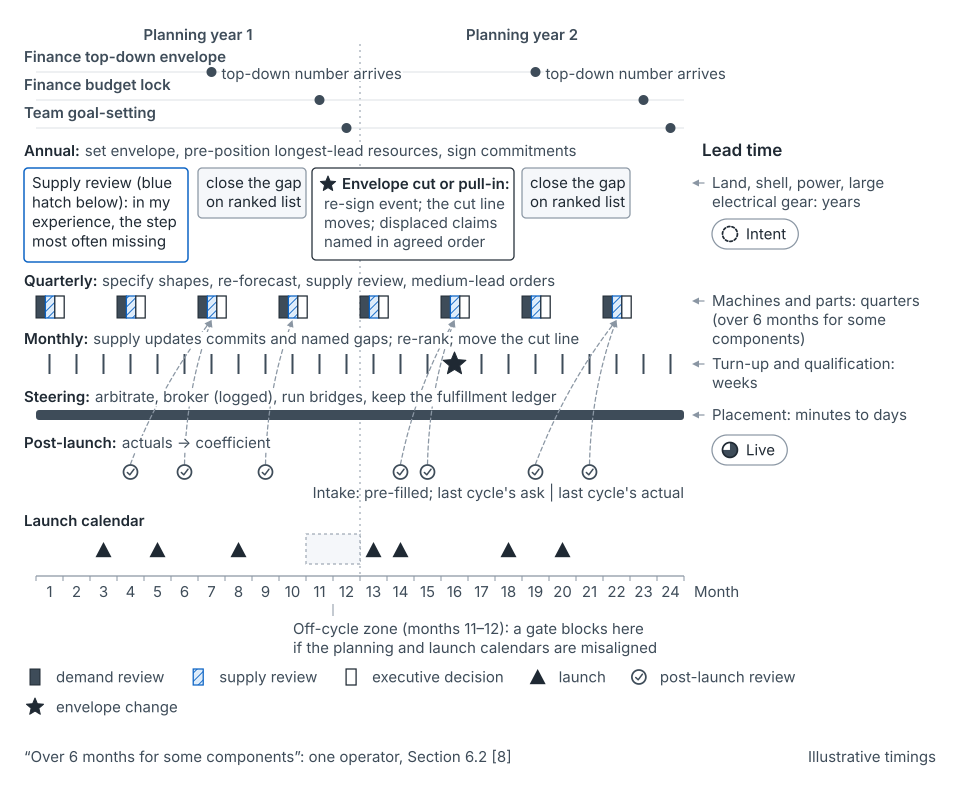

## What happens at this cadence

At the annual review, one slide sums every team's ask and the next shows finance's number. This cadence exists to close that gap. It commits only what its lead time forces: the envelope, the first cut line and the slowest supply. Everything faster waits for [the quarterly cycle](stage-quarterly.md).

- **Envelope.** Finance sets the envelope top-down. You draw the first cut line through the ranked list, and agree the re-cut order for when the envelope moves.
- **Region or site.** Power, land and buildings commit here, years ahead, mostly as options. Long-haul network and large contracts often commit here too, while launches are still intents.
- **Portfolio.** Every team's ask is summed and ranked. Strategic bets enter as intents, each at a share of the envelope.
- **Launch.** A launch is usually an intent: an owner, a driver, a size range, a half-year or year.
- **Unit.** Service owners sign efficiency commitments into the annual agreement. Coefficients themselves are agreed quarterly [argued].

"Strategic bets" is this guide's term for large, uncertain demand bets at the envelope or portfolio level [argued]. The seed paper treats them as intents (Section 5.4) and as groups of launches (Section 6.6).

## Commit points that land here

Power, land, building shells and large electrical gear take years. One operator says they are "planned years in advance" [8]. Grid connections and large transformers each take years [60–62]. Hixson and Guliani give five years as an example "if you erect your own buildings" [6].

Long-haul network and large contracts take several quarters, so they land here or at quarterly. The seed paper's example commits network at −15 months, at Intent (Section 6.5).

So these layers commit before most launches firm up. Only the portfolio envelope can serve the slowest of them. Alphabet's chief executive put it plainly: "how we close the gap this year is a function of what we have done in the prior years" [90].

With the [commit-point method](concept-commit-points.md), one more commit lands here. A cautious lead time and a real need date move the high-memory commit point to −11, at Intent (Section 8.4). That puts it in this column, not the quarterly one. Asking for the slow attribute while the launch is still an intent is the guide's central lesson [argued]. See [the map](the-map.md) and [supply layers and lead times](concept-supply-layers-and-lead-times.md).

## What you do

**Set the envelope and the first cut line.** Declared demand sums higher than finance's envelope. Hixson and Guliani say "it will almost certainly be impossible to fund the capacity requested of each product at its most optimistic growth rate without any improvements in efficiency" [6]. So name everything below the cut line. Don't trim it pro rata. This is leading work, held with the capital side.

**Agree the re-cut order now.** Envelopes move after signing. A mid-cycle cut moves the cut line in an order agreed beforehand. For example, if a 10% cut (illustrative) moves one line, the plan survives. Renegotiated team by team, it doesn't.

**Pre-position the longest-lead supply.** Buy slow layers toward the high scenario, mostly as options or cancelable commitments. Land options, utility reservations with release terms and deposits on long-lead gear all count. Write each shell's specification against the high scenario, so it stays fungible. This is supply-side work. The reasoning sits in [buffers and reserves](concept-buffers-and-reserves.md).

**Ask for slow attributes at intent.** Region, redundancy tier, hardware class and data stored drive the slowest supply. Ask for each as a range now, before its layer commits. See [demand and declarations](concept-demand-and-declarations.md).

**Size strategic bets from the record.** Each intent enters at a share of the envelope, sized from how past intents landed. For example, if intents across all teams land at 60% of declared size, a new intent enters near 60% (illustrative). Before applying a portfolio haircut, check which bets share a driver. Hixson and Guliani tell finance to check whether products are "correlated with each other in terms of growth and cost" [6].

**Sign forecasts, efficiency commitments and ratios.** Write teams' forecasts and efficiency commitments into the annual agreement (mechanism 7). Then the agreement enforces them, not a person. Finance and product sign the shortage-to-idle ratios per supply layer, with supply's idle costs and liability terms. See [operating mechanisms](concept-operating-mechanisms.md).

**Close before finance's budget lock.** Close the annual horizon a few weeks before the lock. Write commitments into teams' own goals.

**No surprises in the room.** Walk the numbers up in steps, so nobody in the decision meeting sees their number for the first time. The [people page](people.md) has the sequence.

## The example, at this cadence

*From the seed paper, Figure 37.* Each horizon commits only what its lead time demands. Illustrative timings.

Product A's launch on Service X, from about −12 months. All numbers are illustrative.

- **Envelope.** A's forecast and X's efficiency commitment are signed into the annual agreement. A's launch claims its share of the envelope as an intent.
- **Region or site.** With the method (Appendix A): power and positions in X's hall committed at −20, in an earlier cycle, sized for the portfolio. At −12 the planner checks the intent fits; A's claim is 7 of the 8 free positions. At −11, one high-memory machine is ordered firm and one reschedulable.
- **Portfolio.** The intent enters at 60,000 requests per second, where comparable intents had landed. With the method (Appendix A): change bands of ±50% at intent are signed.
- **Launch.** A declares an intent of 40,000 to 100,000, for the start of the second quarter. Without the method, nobody asks about memory. With the method (Appendix A): stored data is asked as a range, and A answers 8 to 20 TB.
- **Unit.** X's coefficient is 1.0 ms per request, priced on CPU only. Nothing in the rate card sees memory.

## What goes wrong

- The envelope is trimmed pro rata, so nobody knows which claims were cut.
- No re-cut order exists, so a mid-year cut reopens every commitment.
- Shells wait on machines, or machines wait on shells. Microsoft's chief executive: "I don't have warm shells to plug into" [66].
- Strategic bets share one driver, so they land or slip together, and the haircut leaves you short.
- Intents park capacity for launches nobody mentions anymore. Set expiry dates.

## How to tell it's working

The seed paper tests three mechanisms that start here. Intents' size error becomes stable enough to discount (mechanism 12). Fewer orders land after their commit point (mechanism 13). Forecast bias falls within a stated number of cycles (mechanism 2). Mechanism 7 has no test yet; watch capacity under signed commitment. A signed ratio also implies a shortage budget: at 4 : 1, about one launch in five needs a bridge (an analogy, not a result).

## What it hands on

It receives the year's post-launch reviews through the quarterly intakes they fed: restated coefficients, stage records and asks beside actuals [argued]. It passes [the quarterly cycle](stage-quarterly.md) an envelope, a cut line, a re-cut order, intents with ranges and signed ratios.

| Artifact | Mechanism | Owner | Comes from | Goes to |
|---|---|---|---|---|
| Annual capacity agreement | 7 | Consuming team's leader, with finance | Last year's actuals and records | Quarterly intake; post-launch scoring |
| Landing rule | 8 | Planning, with finance | Last year's recoveries | Post-launch, where recovery lands |
| Planning calendar | 9 | Planning program lead | Finance's budget lock; launch calendar | Every cycle |
| Forum decision log: ranked list, cut line, re-cut order | 10 | Named executive forum, run by planning | Summed asks; finance's envelope | Quarterly and monthly re-ranks |
| Declaration register: intents | 12 | Declaring team; planning keeps it | Intake | Quarterly, as intents become Dated |
| Commit-point map: slow layers | 13 | Supply chain, with planning | Supply's lead times | Supply plan of record (11) |

Placing each artifact at this cadence is the guide's reading [argued]. See [the map](the-map.md) for how the columns connect.

## Where this comes from

Seed paper, Section 9.1 (cadence, closing the gap, no surprises), Sections 5.4, 6.2, 6.5 and 6.6, Section 8.4, Section 9.2, Section 10.2 (signed ratios), and Appendix A and Appendix B. Hixson and Guliani supply the funding gap, order times and the correlation check [6]. Olavson's team supplies the slow layers' lead times [8]. The cadence is sales and operations planning [23], nested as in hierarchical production planning [3].
