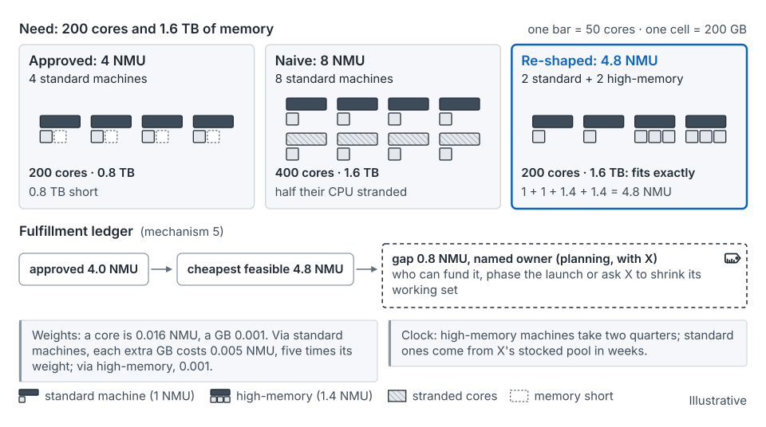

## What happens at this cadence

The monthly cycle turns approvals into commitments. Supply updates its commits and named gaps. Launches are re-ranked against what supply can actually deliver, and the cut line moves if it must (Section 9.1 of the seed paper). This is where declarations reach the Configured stage, at about −3 months, and earn a place on the ranked list.

- **Envelope:** you track what has been committed against the envelope, and you move the cut line when supply or the envelope moves [argued]. A mid-cycle cut follows the re-cut order agreed beforehand.
- **Region or site:** machines arrive and are turned up. Turn-up is a rate set by crews, test positions and ports, so slots get booked here.
- **Portfolio:** the fulfillment ledger is the main artifact. Each approved ask shows how far it has travelled, and every gap has an owner.
- **Launch:** the declaration reaches Configured: regions, shapes, ramp and peak shape. It must now be committed or have its gap named.
- **Unit:** the ask becomes a shape, a place and a time. A shared service learns which of its dimensions binds.

## Commit points that land here

Machines from a stocked pool commit here, at Configured. They arrive in weeks, so they can wait until the launch is configured. Turn-up and allocation commit here too: slots are booked against a rate staffed months before. Job placement and admission wait for weekly. The slower layers committed at [annual](stage-annual.md) and [quarterly](stage-quarterly.md). See [the map](the-map.md), [commit points](concept-commit-points.md) and [supply layers and lead times](concept-supply-layers-and-lead-times.md).

The seed paper sketches the stocked pool as a *fast lane*: dearer, but able to wait for configuration (Section 8.6). That is an exploration, not a tested result.

## What you do

**Get supply's answer for every approved ask.** Each line gets a dated commit (quantity, date, confidence, any substituted shape) or a named gap. A named gap says how much, by when, why, and which bridge, owned by whom. Until supply answers, label the approval *uncommitted*. An approval becomes firm when supply answers it, not when the forum votes (Section 10.1).

**Keep the fulfillment ledger.** One line per ask, in seven columns: approved (gross), net, committed, allocated, delivered, live, adopted (mechanism 5). Planning carries the gap. Each performer owns its entry: supply owns committed and delivered, the site team owns live. Netting sits between approved and allocated, and every number in it needs a date and an owner; see [approval and allocation](concept-approval-and-allocation.md).

**Treat approval and allocation as two acts.** A common unit lets the forum compare unlike asks. It doesn't deliver machines of the right shape, in the right place, on time. Hixson and Guliani list approving and provisioning as separate steps [6]. The 2026 SRE chapter asks for capacity at "the right consumer, in the right location, at the right time" [7].

**Re-shape before you cut.** When memory or IOPS binds, ask which part of the design really needs it. The SRE chapter's Meet case halved the instance count by doubling CPU and memory per instance [7].

**Promote on evidence only.** A declaration reaches Configured after a design review and a place on the launch calendar (Section 5.4). Only then does it get a place on the ranked list, grants and turn-up. A configured launch whose date passes unconfirmed loses its grant. See [demand and declarations](concept-demand-and-declarations.md).

**Name the bridge before you need it.** Where the answer is a gap, write the bridge, its owner and a ready-by date. A draw on the stocked pool leaves a replenishment owed. Peg each order to the declaration it serves, so a late delivery points to the launches it hits.

Learning planners usually work single asks through the ledger; practicing planners run the re-rank and gap list with supply [argued]. See [the work and the path](the-work-and-the-path.md).

*From the seed paper, Figure 30.* The forum approved 4 NMU because the intake asked only about CPU; the cheapest fit is 4.8, and the 0.8 gap needs an owner. Illustrative.

## The example, at this cadence

Product A's launch on Service X, from about −3 months. All numbers are illustrative.

- **Envelope.** —
- **Region or site.** Without the method, the high-memory machines are ordered now and arrive at +3. With the method (Appendix A): −3 is the standard-machine commit point. Two standard machines come from X's pool as firm, one as a named reserve. Four turn-up slots are booked.
- **Portfolio.** Without the method, the ledger records 4.0 NMU approved, 4.8 as the cheapest fit, and a 0.8 gap with a named owner. It needs a dated bridge, and a pool draw leaves a replenishment owed. With the method (Appendix A): the ledger line drops from 7.2 to 5.8 NMU after a push-out.
- **Launch.** A is Configured: two regions and its stored data. With the method (Appendix A): the eighth-lowest configured outcome is 70,000. So the second high-memory order is pushed out and re-pegged, and a bridge owned by X is named above 70,000.
- **Unit.** Without the method, memory surfaces here. A's data in X grows 16 TB, needing 1.6 TB of memory; four standard machines supply 0.8 TB. X's rate card prices only CPU, so it can't see this.

## What goes wrong

- An approval is treated as delivery, and the launch finds no usable machines.
- The intake asked only about CPU, so the binding dimension shows up after its commit point.
- A reclaim or decommission in the netting slips, and looks like a supply failure.
- The cut line moves silently, trimming everyone pro rata instead of naming what fell below it.

## How to tell it's working

The seed paper gives three tests that can fail (Section 9.2). With the ledger (mechanism 5), fewer launches are delayed for capacity. With supply's register (mechanism 11), promised and actual delivery dates converge, and fewer approvals turn out to be undesigned gaps. With the commit-point map (mechanism 13), fewer orders are placed after their commit point. Watch the unfulfilled backlog and its age. None of these tests has been run yet.

## What it hands on

From [quarterly](stage-quarterly.md): dated declarations, medium-lead orders and supply's review. To [weekly](stage-weekly.md): a ledger with every gap named, bridges owned and dated, and a ranked list supply has answered.

| Artifact | Mechanism | Owner | Comes from | Goes to |
|---|---|---|---|---|
| Fulfillment ledger | 5 | Planning carries the gap; each performer owns its entry | Quarterly approvals | Weekly bridges and trades |
| Supply plan of record and commitment register: commits and named gaps | 11 | Supply chain, with planning and finance | Quarterly supply review | Weekly re-pegging; post-launch scoring |
| Declaration register: Configured, expiry checked | 12 | Declaring team; planning keeps it | Quarterly Dated entries | Weekly slips; post-launch scoring |
| Commit-point map: stocked pool, turn-up | 13 | Supply chain, with planning | Quarterly map | Turn-up slots booked |
| Forum decision log: re-rank, cut-line moves | 10 | Named executive forum, run by planning | Quarterly ranked list | Weekly escalations |

Placing each artifact at this cadence is the guide's reading [argued].

## Where this comes from

Seed paper, Sections 5.4, 6 (intro), 6.1, 6.4, 6.5, 7, 8.2–8.3, 9.1–9.3 and Appendix A.4–A.5. The separate steps of approving and provisioning come from Hixson and Guliani [6]. The right consumer, location and time, and the Meet re-shape, come from the 2026 SRE chapter [7]. Operators publish monthly versions, such as a rolling four-quarter consensus [8]; the cycle is sales and operations planning for infrastructure [23].
