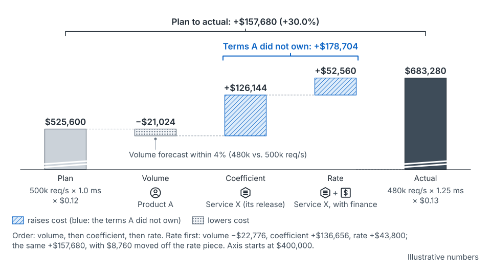

## What happens at this cadence

This is where the loop closes: actuals become the next coefficient, discontinuities are logged, and misses are split by owner (Section 9.1 of the seed paper). The review runs about a month after each launch. It feeds the next quarterly intake (seed paper, Figure 37) and, through it, the next annual plan [argued].

- **Envelope:** you restate the plan on actuals, and re-baseline after a shock or a large drift. The unused and unallocated lines are read here.
- **Region or site:** stranded capacity and expired grants are found and reclaimed. Reclaimed capacity enters the next netting as "due back".
- **Portfolio:** variance is split by owner: volume, coefficient and rate. Declarations are scored by the stage at which they were made.
- **Launch:** the declaration moves from Live to Organic. Its coefficient is measured on actuals, and later phases are sized on it.
- **Unit:** the two alerts run against the published coefficient, and recovered capacity lands by the landing rule.

## Commit points that land here

None. Post-launch commits no supply. It changes what the next commit points start from: restated coefficients, stage records, lead-time records and reclaims with dates and owners. See [commit points](concept-commit-points.md).

## What you do

**Turn actuals into the next coefficient.** The first phase is the measurement; size the rest of the rollout on it (Section 5.4). Publish any change as a new version with an effective date, not a quiet edit. See [the coefficient](concept-the-coefficient.md).

**Log discontinuities.** Hardware changes, migrations, re-grains and launches go in the discontinuity register (mechanism 6). Restate history at a known break, per service, instead of fitting a trend through it (Section 5.3). Where the ratio must be estimated, intervention analysis handles the break explicitly [55]. Reclamation changes supply, not the coefficient, so keep it out of the coefficient's history.

**Split the miss by owner.** Swap in one actual at a time: volume, then coefficient, then rate. Volume goes to the product team, the coefficient to the service owner, the rate to the service owner with finance. The order is a policy choice; a symmetric index avoids choosing [52]. Who *pays* is a separate rule, agreed with finance before the miss. See [three prices](concept-three-prices.md).

**Run the measuring loop.** The 2026 SRE chapter's loop watches the ratio and raises two alerts: one when it shifts, one when consumption "deviates from predictions" [7]. Route the ratio alert to the service owner and the forecast alert to the product team [argued]. The steps are in [the measuring loop](concept-measuring-loop.md).

**Close the declaration.** It reaches Organic when its ramp is complete and its demand can be extrapolated like any other. Hixson and Guliani ask "how quickly you start to treat past launches as part of the organic line" [6].

**Score declarations by stage.** Record the stage of each ask, declared size against actual, and declared date against actual. Itemizing step changes "gives you room to learn as you repeat the process" [6]. Start from all teams' same-stage record, a reference class [10], and weight each team's own record as it builds. See [demand and declarations](concept-demand-and-declarations.md).

**Land efficiency by the rule.** Recovered capacity splits as the landing rule says, agreed before any recovery (mechanism 8). It must land where the recoverer sees it, as gain-sharing plans recognize [4].

**Reclaim stranded and expired grants.** A configured launch's grant lapses if its date passes unconfirmed. The SRE chapter describes AI sweeps that reclaim "inactive or expired ML quota credits" [7]. The paper adds that a sweep should follow the landing rule and honor a right of recall [argued]. Log each reclaim like an override, since "agents can behave in surprising ways" [7].

**Re-baseline when the plan stops being useful.** After a shock or large drift, pick a date and snapshot actuals as the new baseline. Work team by team, brokering excess to shortage. Capacity below the agreed utilization floor returns to the shared reserve. Then restart the forecast (Section 10.2) [argued]. The paper also floats re-baselining on a set cadence, or past a money threshold, with each gap scored by owner [argued]. That sits close to the chapter's advice to backtest and periodically validate [7].

Practicing planners can run the alerts and the scoring. Leading planners restate the plan and own re-baselines. The capital side owns payment rules [argued]. See [the work and the path](the-work-and-the-path.md).

## The example, at this cadence

Product A's launch on Service X, about a month after it lands. All numbers are illustrative.

- **Envelope.** At the planned coefficient, the capacity built for the missing 20,000 would sit on X's unused line, $21,024 a year, booked to no one. This year the coefficient drift used it, which was luck (Section 7). With the method (Appendix A): about $26,280 a year of extra spare sits inside the 4 : 1 ratio, recorded against A's declaration.
- **Region or site.** The high-memory machines arrive at +3, ending the bridge. The pool's replenishment comes due. 600 busy cores need 1,200 installed against 1,000 planned.
- **Portfolio.** A's volume lands at 480,000, within 4%. Its bill lands at $683,280 against $525,600, 30% over. The split: volume −$21,024 (A), coefficient +$126,144 (X), rate +$52,560 (X with finance).
- **Launch.** The launch lands at 40,000, six weeks late, and joins the stage record. With the method (Appendix A): both misses fall outside the configured band and are recorded against A's declaration.
- **Unit.** X's coefficient is restated at 1.25 ms per request, as a new version. X adds data stored as a second driver, from its effective date, not retroactively. The intake now asks for stored data as a range at intent.

**Tracing it upward.** A release of X raised CPU per call from 2.5 to 3.125 ms, so α moved from 1.0 to 1.25 ms per request: the unit row. On A's bill, that is the coefficient term: 480,000 × 0.25 ms is 120 more busy cores, or +$126,144. At the region, those cores became 1,200 installed against 1,000 planned, and the extra 200 came from bridges. The forum charges the CPU bridge premiums to their cause, X's release, held outside X's rate (Section 7).

*From the seed paper, Figure 31.* The two terms A did not own add up to more than the whole overrun. Illustrative.

## What goes wrong

- A coefficient is edited quietly, and every caller's bill moves without a version.
- The miss is argued as fault, and the team pads next year's ask.
- Declarations are never scored, so intents keep entering at face value.
- A reclaim sweep feels like punishment, and hoarding comes back.

## How to tell it's working

Four tests from the seed paper can fail (Section 9.2). Forecast bias falls within a stated number of cycles (mechanism 2). Variance from unannounced changes shrinks (mechanism 3). Re-funded recovery lasts, and clawed-back recovery decays (mechanism 8). Intents' size error becomes stable enough to discount (mechanism 12). None has been run.

## What it hands on

From [weekly](stage-weekly.md): live launches, bridge premiums, slips and owed replenishments. To the next [quarterly](stage-quarterly.md) intake: restated coefficients, new drivers, stage records, each team's ask beside its actual, and reclaims due back. Through that intake they reach the next [annual](stage-annual.md) plan [argued]. That closes the loop on [the map](the-map.md).

| Artifact | Mechanism | Owner | Comes from | Goes to |
|---|---|---|---|---|
| Coefficient register and rate card: restated versions, new drivers | 3 | Service owner, with finance | Actuals; hardware changes | Next quarterly intake |
| Unused and unallocated lines | 4 | Service owner; finance keeps score | Actuals against plan | Next annual envelope |
| Discontinuity register | 6 | Coefficient owner | Releases, migrations, re-grains, reclaims | Coefficient restatements |
| Landing rule, applied | 8 | Planning, with finance | Annual agreement | Next netting |
| Declaration register: scored, closed to Organic | 12 | Declaring team; planning keeps it | Weekly slips and actuals | Next intake's stage records |
| Intake: prior ask beside prior actual | 2 | Consuming team; planning supplies data | Actuals | Next quarterly intake |
| Commitment register: promises scored | 11 | Supply chain, with planning and finance | Weekly re-pegging; deliveries | Next supply review |

Placing each artifact at this cadence is the guide's reading [argued].

## Where this comes from

Seed paper, Sections 5.2, 5.3, 5.4, 6.4, 6.6, 7, 9.1–9.3, 10.2 and Appendix A.5–A.6. The measuring loop, the two alerts, backtesting and quota sweeps are the 2026 SRE chapter's [7]. Itemizing step changes and the organic line come from Hixson and Guliani [6]. Reference classes are [10]; symmetric decomposition [52]; intervention analysis [55]; gain-sharing [4]. See also [cases](cases.md).
