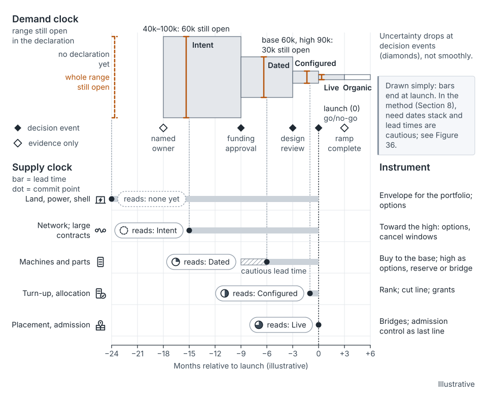
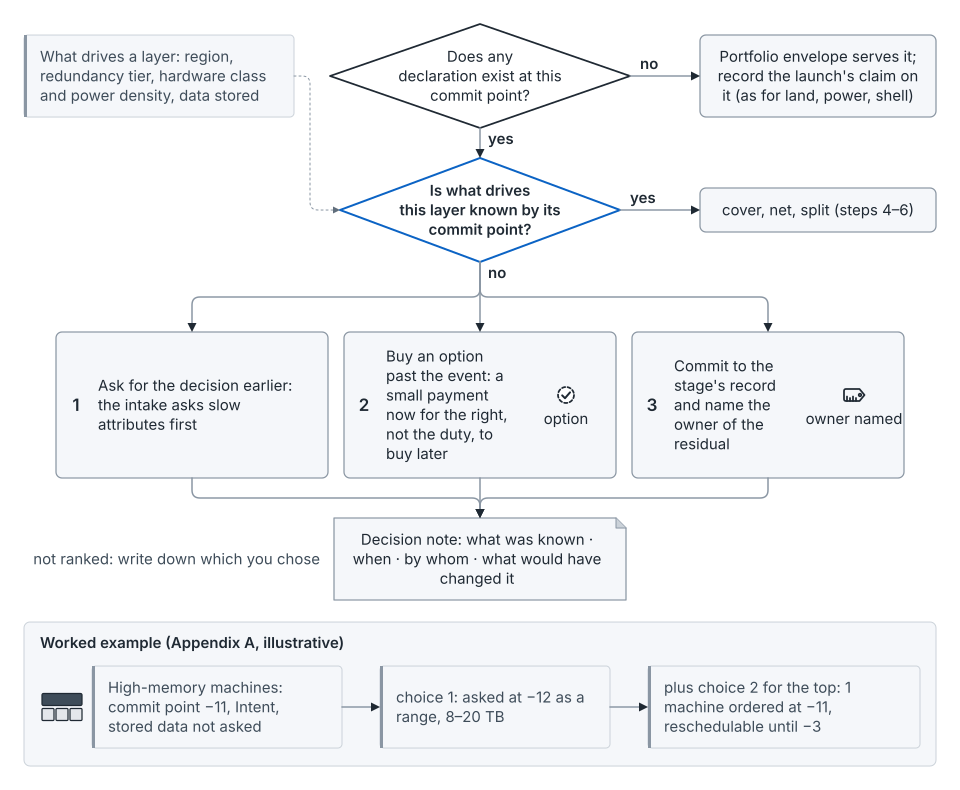

## What happens at this cadence

The quarter is where demand gets specific enough to order against. You specify demand in driver units and shapes, re-forecast against actuals, and hear supply's answer. Then medium-lead orders go in. Each quarterly intake also takes in the post-launch reviews of the quarter before (seed paper, Figure 37).

- **Envelope.** Re-plan against the annual envelope. A supply slip is an envelope change in time, handled as a re-cut.
- **Region or site.** Machines and parts commit here, one to three quarters ahead. Long-haul network and large contracts commit here or at annual.
- **Portfolio.** Forecasts are re-run against actuals. Declarations firm up, and the ranked list is refreshed.
- **Launch.** A launch moves from Intent to Dated. The last quarterly review before launch may re-confirm it; it reaches Configured at about −3, in [the monthly cycle](stage-monthly.md).
- **Unit.** Each service's coefficients and rates are agreed as versions in the register [argued].

## Commit points that land here

Machines and parts take quarters; one operator reports "over 6 months for some components" [8]. They typically commit one to three quarters ahead, while the declaration is Dated. Long-haul network takes "months or even years" [63], so it lands here or at [annual](stage-annual.md). So buy to the base and hold the high as options, a launch reserve or a named bridge. See [the map](the-map.md), [commit points](concept-commit-points.md) and [supply layers and lead times](concept-supply-layers-and-lead-times.md).

## What you do

**Specify demand in driver units and shapes.** Pre-fill the intake from telemetry. The team confirms its driver forecast and signs any override. Put last quarter's ask beside its actual (mechanism 2). This is practicing work.

**Re-forecast against actuals.** Separate bias from spread. Correct bias at intake; size buffers from the spread. Restate history at known breaks, such as a hardware change, before fitting a trend.

**Hold the supply review.** Supply brings what it can commit, where it can't, and which risks moved. This is often the step that's missing [argued]. Place medium-lead orders on its answers, not before. Send vendors the base and hold the high as options, so padding doesn't travel upstream [67].

**Firm declarations to Dated.** A dated declaration carries a quarter, base and high scenarios [8], and the attributes that drive slow supply. Ask for slow attributes first: region, redundancy tier, hardware class, data stored. Size usually firms last. See [demand and declarations](concept-demand-and-declarations.md).

**Agree the coefficients.** Publish each coefficient and rate with a version, effective date, owner and valid range (mechanism 3). A change is a new version, not a quiet edit. The SRE chapter's ratio alerts flag drift between versions [7]. See [the coefficient](concept-the-coefficient.md) and [the measuring loop](concept-measuring-loop.md).

**Use the right price.** Average rates set budgets. Long-run incremental cost decides what to build. The shadow price ranks claims on whatever binds this quarter [argued]. See [three prices](concept-three-prices.md).

**Hold the high scenario as options or a reserve.** The seed paper offers one way to think about it. Hold one reserve for a group of launches with no shared driver, sized to the group's high. For example, four independent 25,000 slices need about 75,000 together, not 100,000 (illustrative). See [buffers and reserves](concept-buffers-and-reserves.md).

**Place gates between events and orders.** Sometimes an order is due before the event that would size it. Then ask earlier, buy an option past the event, or commit to the stage's record and name who owns the rest. Write down which.

Practicing planners usually run the intake and the commit-point lines. Leading planners hold the supply review and re-plan the envelope, with the supply side [argued]. See [the work and the path](the-work-and-the-path.md).

## The example, at this cadence

*From the seed paper, Figure 22.* Demand firms up on one clock; supply commits on another. Illustrative.

Product A's launch on Service X, from about −6 months. All numbers are illustrative.

- **Envelope.** —
- **Region or site.** Without the method, −6 is the high-memory commit point, and it passes with no memory question asked. With the method (Appendix A): those machines were ordered at −11. A reclaimed high-memory machine, due at −4 and owned by X, is tracked.
- **Portfolio.** The forum approves 4 NMU on CPU alone and names a bridge for the high. A's plan is priced at $525,600.
- **Launch.** A is Dated: base 60,000 and high 90,000 requests per second. With the method (Appendix A), that sits inside the ±50% band signed at intent.
- **Unit.** X's coefficient stays at 1.0 ms per request, with CPU at $0.12 per busy core-hour. The cheapest fit is really 4.8 NMU, because memory binds. Via standard machines, each extra GB costs five times its weight: memory's shadow price.

*From the seed paper, Figure 24.* Ask earlier, buy an option past the event, or commit to the stage's record and name the owner. Illustrative.

## What goes wrong

- No supply review, so approvals look firm before supply has answered.
- The intake asks only about the dimension the rate card prices, and the binding one surfaces after its commit point.
- A coefficient drifts without a new version, so every caller's bill moves unannounced.
- Orders go in before supply's answer, or padding reaches the vendor.
- Each launch holds its own high scenario, buying the sum of peaks.

## How to tell it's working

The seed paper's tests: variance from unannounced changes shrinks (mechanism 3). Promised and actual delivery dates converge (mechanism 11). Fewer orders land after their commit point, with smaller bridge premiums (mechanism 13). Forecast bias falls within a stated number of cycles (mechanism 2). None of these has been measured in public.

## What it hands on

It receives the envelope, cut line, intents and signed ratios from [the annual cycle](stage-annual.md). It also receives the last quarter's [post-launch](stage-post-launch.md) actuals and restated coefficients, through the intake. It passes [the monthly cycle](stage-monthly.md) dated declarations, a supply answer per line, placed orders and agreed coefficients.

| Artifact | Mechanism | Owner | Comes from | Goes to |
|---|---|---|---|---|
| Intake: declared demand, prior ask beside prior actual | 1, 2 | Consuming team's accountable lead; planning pre-fills | Telemetry; post-launch actuals | Forum; declaration register |
| Coefficient register and rate card | 3 | Service owner, with finance | Post-launch restatements | Monthly and weekly; every caller's bill |
| Declaration register: Intent to Dated | 12 | Declaring team; planning keeps it | Annual intents | Monthly, for Configured |
| Supply plan of record and commitment register | 11 | Supply chain, with planning and finance | Supply review | Monthly commits and gaps |
| Commit-point map: machines and parts | 13 | Supply chain, with planning | Supply's lead times | Orders placed |
| Forum decision log: refreshed ranked list | 10 | Named executive forum, run by planning | Annual cut line | Monthly re-rank |

Placing each artifact at this cadence is the guide's reading [argued].

## Where this comes from

Seed paper, Section 9.1 (the quarterly cycle, the supply review and Figure 37). Also Sections 4, 5.2–5.4, 6.1, 6.2, 6.5, 6.6, 7, 8, 9.2–9.3 and Appendix A. Olavson's team supplies base and high scenarios and component lead times [8]. Meta's backbone planners supply the network lead time [63]. The SRE chapter supplies the measuring loop [7]. Lee and colleagues supply the rationing game [67]. Auxon builds quarterly plans on earlier quarters' expected outcome [1].
