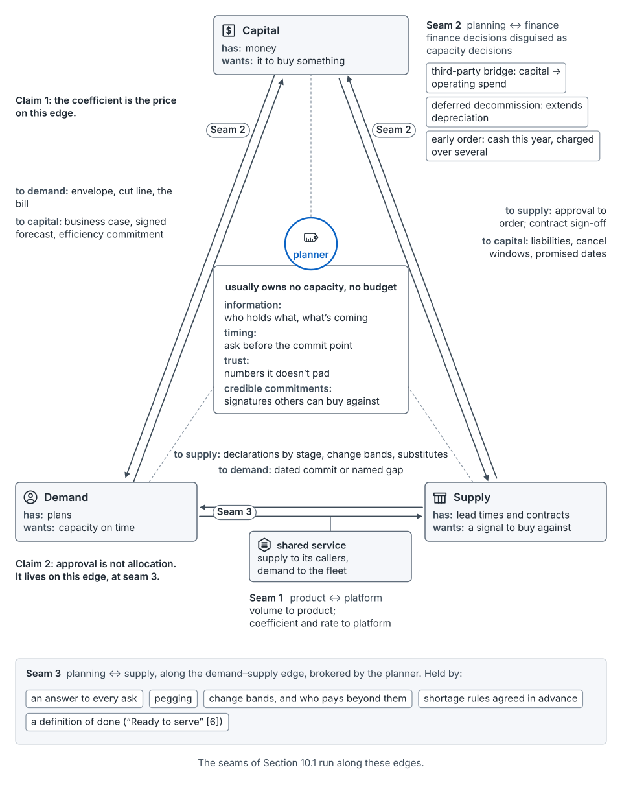
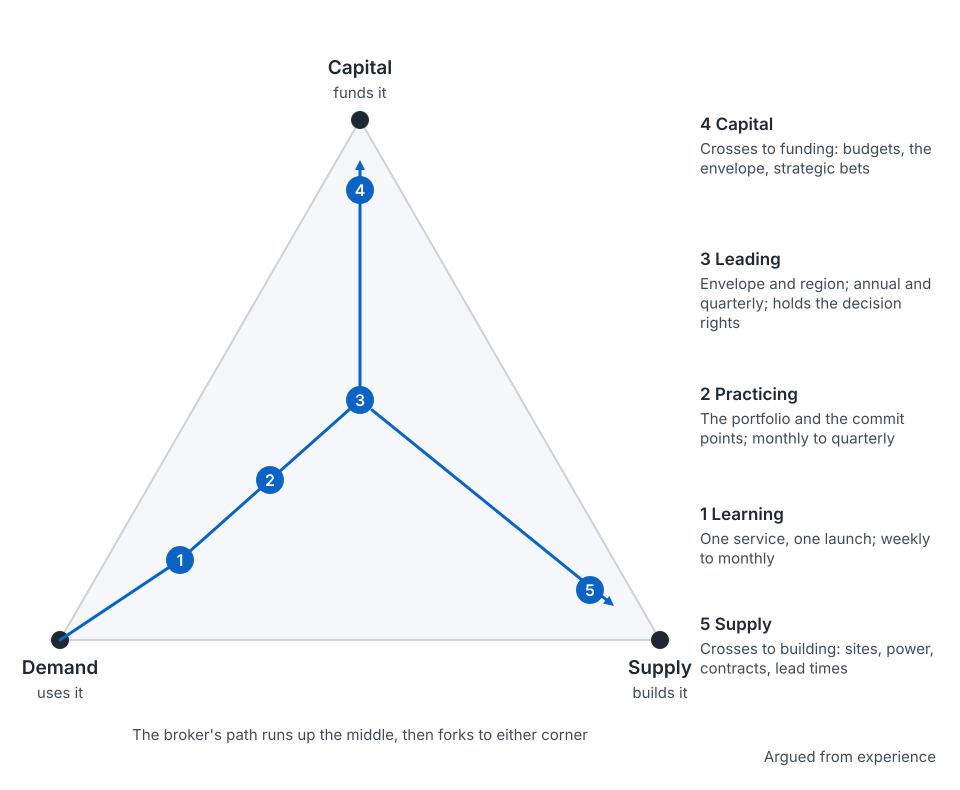

## What the work is

The 2026 SRE chapter defines capacity planning as "the discipline of forecasting future demand and provisioning the supply to meet it" [7]. That's the core. In practice, the job has a third part: keeping the agreement that pays for it. [argued]

Every capacity plan is a handshake among three parties (seed paper, Section 10):

- **Capital** funds it: finance and the leaders who set the envelope.
- **Demand** uses it: the teams that launch and grow products, and the shared services they call.
- **Supply** builds it: the supply chain, the sites and the fleet.

The planner sits in the middle, usually owning no capacity and no budget. What you trade is information, timing, trust and commitments others can buy against. The rest of this guide is about doing that well.

*From the seed paper, Figure 41.* Capacity is a handshake among capital, supply and demand. The planner sits in the middle, usually with no capacity and no budget.

## How people come into it

There's no single entry route. People commonly arrive from: [argued]

- **Hardware and accelerators.** You know the machines well, often the newest ones. The new parts are lead times, contracts, forecasts and people.
- **Site reliability or infrastructure engineering.** You know load, headroom and failure. The new parts are money, supply and the annual cycle.
- **Finance.** You know budgets, depreciation and the envelope. The new parts are shapes, places and lead times.
- **Supply chain.** You know orders, vendors and lead times. The new parts are declarations and coefficients.
- **Program management.** You know how to run a cadence and a forum. The new parts are the numbers underneath.

Each route brings one corner of the handshake. The work asks for all three.

## The path

The work spans a map: five altitudes, from one service up to the whole envelope, across a cadence from weekly to annual ([the map](the-map.md)). The path through the discipline climbs that map. You start where the work is small and near, and you widen in scope and in time. [argued]

*The path, drawn on the handshake.* The broker's path runs up the middle, then forks to either corner. Argued from experience; not measured.

| Level | Usually works | You're learning to |
|---|---|---|
| **1. Learning** | One service and one launch; weekly to monthly | Read a coefficient, run an intake, check shape, place and time, keep a ledger honest |
| **2. Practicing** | The portfolio and its commit points; monthly to quarterly | Run the supply review, stage declarations, rank against supply, name gaps |
| **3. Leading** | The envelope and the regions; annual and quarterly | Set the cut line with finance, run the forum, hold the decision rights, re-baseline |
| **4. Capital** | Crosses to the funding corner | Price the agreement: budgets, the envelope, strategic bets, depreciation |
| **5. Supply** | Crosses to the building corner | Own the clock: sites, power, contracts, vendors, lead times |

At the top, the path forks. You can stay and lead the discipline. Or you can cross to one of the other two corners. The broker has spent years learning both, so either one is a natural next step. [argued]

Levels describe scope, not worth. A planner two years in who remembers what was confusing is as valuable to this body of knowledge as one with twenty.

## Try it on the example

One exercise per level, all on the seed paper's worked example: Product A's launch on Service X (Section 7 and Appendix A). All numbers are illustrative. [argued]

- **Learning.** Split A's bill miss into volume, coefficient and rate, and say who owns each term ([the coefficient](concept-the-coefficient.md)).
- **Practicing.** Fill the [worksheet](/worksheet/) for A's launch: find each layer's commit point, and what the declaration knows by then.
- **Leading.** Set the shortage-to-idle ratios for machines and for power, and write the re-cut order for a 10% envelope cut ([buffers and reserves](concept-buffers-and-reserves.md), [annual](stage-annual.md)).
- **Capital.** Price the roughly 1.0 NMU of spare the method holds, and decide who carries it at a 40,000 landing ([the map](the-map.md), [commit points](concept-commit-points.md)).
- **Supply.** Write the cancel window and reschedule terms for the reschedulable high-memory order ([supply layers and lead times](concept-supply-layers-and-lead-times.md)).

## Reading this guide by level

- **Learning:** start with [principles](principles.md), [the map](the-map.md), then [weekly](stage-weekly.md) and [monthly](stage-monthly.md). Keep [the coefficient](concept-the-coefficient.md) and [demand and declarations](concept-demand-and-declarations.md) open.
- **Practicing:** [quarterly](stage-quarterly.md), [post-launch](stage-post-launch.md) (scoring and alerts), [commit points](concept-commit-points.md), [approval and allocation](concept-approval-and-allocation.md), [people](people.md).
- **Leading:** [annual](stage-annual.md), [post-launch](stage-post-launch.md) (restating and re-baselining), [the operating mechanisms](concept-operating-mechanisms.md), [settings](settings.md).
- **Capital or supply side:** [three prices](concept-three-prices.md), [buffers and reserves](concept-buffers-and-reserves.md), [supply layers and lead times](concept-supply-layers-and-lead-times.md).

Every page has a strip at the top saying which levels usually do that work.

## What's missing

There's no published competency map for capacity planners that we could find. [unmeasured] The levels above are a first sketch. The roadmap's competency map starts here, and it needs people at every level to correct it.

## Where this comes from

- The definition: the 2026 SRE chapter [7].
- The handshake and the broker: the seed paper, Section 10, and the roles in Section 14.
- The entry routes, the levels and the fork are this guide's sketch, argued from experience. [argued]
